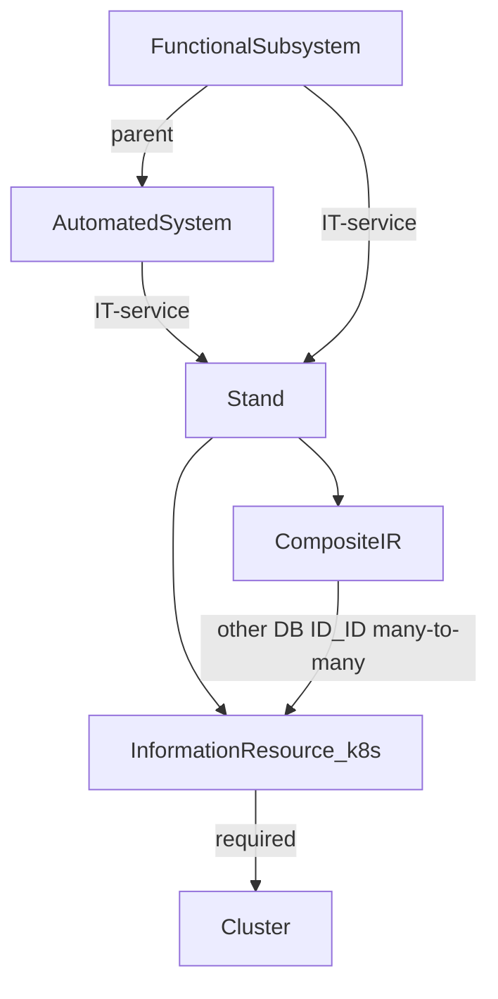
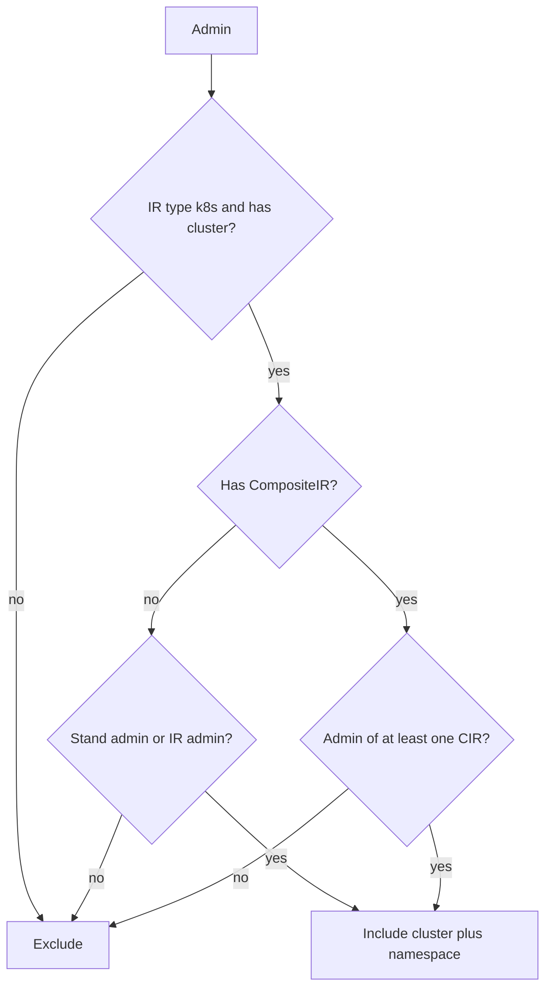

# Анализ перечней k8s-проектов администратора

На этом этапе **проект = ИР с типом Kubernetes** (namespace). Базы и прочие типы ИР в выборку не входят. У такого ИР обязательна связь с **кластером**; без кластера проект в список не попадает (fail-closed).

## Итоговый артефакт

Цель анализа и последующей выборки — не «права в вакууме», а **готовый перечень на каждого админа**:

`админ → [(кластер, проект-ИР), …]`

- Ключ — конкретный человек из списков администраторов (один идентификатор во всех уровнях).
- Значение — уникальные пары **кластер + k8s-ИР** (namespace), которые прошли матрицу прав.
- Один и тот же ИР, видимый через стенд и через СИР, в списке админа один раз.
- Админ без ни одной прошедшей пары попадает в результат с **пустым** списком (явно, не «пропущен»).
- Это полный проход по всем админам, не разовый запрос «для одного человека».

Пример формы:

- `admin_A`: `(cluster-1, ns-app)`, `(cluster-2, ns-jobs)`
- `admin_B`: `(cluster-1, ns-app)`
- `admin_C`: `[]`

## Граф сущностей



Зафиксированные факты:

- ИТ-услуга стенда — **либо АС, либо ФП**.
- У стенда ровно одна ИТ-услуга. Админы стенда — **подмножество** админов этой услуги (не копия на все стенды: стендов много).
- Ниже стенда списки **не копируются и независимы**: СИР и ИР могут иметь произвольный состав, человек не обязан быть админом стенда/услуги.
- СИР опционален. ИР всегда привязан к стенду.
- Один ИР может входить в **несколько СИР**; все эти СИР принадлежат **тому же стенду**.
- Связь СИР–ИР во второй БД в формате `ID_ID`.

## Правило видимости k8s-проекта

Обозначения: человек либо входит в список админов сущности (`Y`), либо нет (`N`). `—` значит «уровня нет» (ФП, если стенд висит на АС; СИР, если ИР напрямую на стенде).

Свёртка (после матрицы):

- Если у ИР **нет СИР**: виден, если человек админ **этого ИР** или админ **стенда**.
- Если у ИР **есть один или несколько СИР**: виден, если человек админ **хотя бы одного** из этих СИР (OR). Админ СИР видит ИР **даже без** записи в админах ИР. Админ ИР/стенда/услуги **без** членства ни в одном СИР — **не видит**.
- Админ только АС или только ФП, не назначенный на этот стенд и не входящий в СИР/ИР, **не видит** проекты стенда.

Итог в виде формулы:

```
visible := ir.type == k8s
       AND ir.cluster_id is not null
       AND (
         if no CIR on ir:
           person in ir.admins OR person in stand.admins
         else:
           exists cir in ir.cirs: person in cir.admins
       )
```

АС/ФП в формуле гранта нет: они задают, **из кого можно выбрать** админов стенда. Сами по себе услугу не раскрывают все namespace всех стендов.

Недопустимые комбинации (ломают инвариант «админы стенда ⊆ админы ИТ-услуги»): стенд `Y` при услуге `N`.

## Матрица прав (таблицы)

Легенда колонок: `Y` — человек в списке админов, `N` — нет, `—` — уровня нет, `*` — любое допустимое значение. Колонка **СИР** при наличии СИР: админ **хотя бы одного** СИР этого ИР (OR). Колонка **Результат** — попадёт ли пара `(кластер, проект-ИР)` в список этого админа.

### Сводка: что реально открывает проект

| Условие | Стенд | СИР | ИР | Результат |
|---|---|---|---|---|
| СИР нет | Y | — | * | видит |
| СИР нет | N | — | Y | видит |
| СИР нет | N | — | N | не видит |
| СИР есть | * | Y | * | видит |
| СИР есть | * | N | * | не видит |
| Стенд Y, услуга N | * | * | * | недопустимо |

Админ только АС или только ФП в эту сводку не входит: без стенда / СИР / ИР он проект не видит.

---

### Стенд → АС, СИР нет (ИР напрямую на стенде)

| АС | ФП | Стенд | СИР | ИР | Результат | Комментарий |
|---|---|---|---|---|---|---|
| Y | — | Y | — | Y | видит | стенд + ИР |
| Y | — | Y | — | N | видит | админ стенда видит все k8s-ИР стенда |
| Y | — | N | — | Y | видит | админ ИР независим, не обязан быть на стенде |
| Y | — | N | — | N | не видит | только админ АС |
| N | — | N | — | Y | видит | только админ ИР |
| N | — | N | — | N | не видит | нет ролей |
| N | — | Y | — | * | недопустимо | стенд не из админов АС |

### Стенд → АС, СИР есть

| АС | ФП | Стенд | СИР | ИР | Результат | Комментарий |
|---|---|---|---|---|---|---|
| Y | — | Y | Y | Y | видит | полный набор |
| Y | — | Y | Y | N | видит | админ СИР без записи в ИР |
| Y | — | Y | N | Y | не видит | СИР режет админа ИР и стенда |
| Y | — | Y | N | N | не видит | есть стенд, нет СИР |
| Y | — | N | Y | Y | видит | СИР независим от стенда |
| Y | — | N | Y | N | видит | админ только СИР |
| Y | — | N | N | Y | не видит | админ ИР, но не СИР |
| Y | — | N | N | N | не видит | только АС |
| N | — | N | Y | Y | видит | СИР не требует АС/стенд |
| N | — | N | Y | N | видит | админ только СИР |
| N | — | N | N | Y | не видит | админ ИР без СИР |
| N | — | Y | * | * | недопустимо | стенд не из админов АС |

---

### Стенд → ФП, СИР нет

Админы стенда ⊆ админы **ФП**, не АС. Админ АС сам по себе проекты стенда ФП не открывает.

| АС | ФП | Стенд | СИР | ИР | Результат | Комментарий |
|---|---|---|---|---|---|---|
| * | Y | Y | — | Y | видит | стенд + ИР |
| * | Y | Y | — | N | видит | админ стенда |
| * | Y | N | — | Y | видит | админ ИР |
| * | Y | N | — | N | не видит | админ ФП, не на этом стенде |
| Y | N | N | — | Y | видит | только ИР |
| Y | N | N | — | N | не видит | только админ АС |
| N | N | N | — | Y | видит | только ИР |
| N | N | N | — | N | не видит | нет ролей |
| * | N | Y | — | * | недопустимо | стенд не из админов ФП |

### Стенд → ФП, СИР есть

| АС | ФП | Стенд | СИР | ИР | Результат | Комментарий |
|---|---|---|---|---|---|---|
| * | * | * | Y | * | видит | админ СИР видит ИР, в т.ч. без ИР/стенда |
| * | Y | Y | N | Y | не видит | СИР режет стенд и ИР |
| * | Y | Y | N | N | не видит | есть стенд, нет СИР |
| * | Y | N | N | Y | не видит | админ ИР, но не СИР |
| * | Y | N | N | N | не видит | админ ФП, не на стенде |
| Y | N | N | N | N | не видит | только админ АС |
| N | N | N | Y | N | видит | только СИР |
| * | N | Y | * | * | недопустимо | стенд не из админов ФП |

В строке «СИР = Y» допустимый стенд: либо `N`, либо `Y` при ФП `Y`.

---

### Несколько СИР на одном ИР (OR)

Все СИР этого ИР на одном стенде. Достаточно **одного** совпадения.

| СИР1 | СИР2 | ИР | Стенд | Результат |
|---|---|---|---|---|
| Y | N | * | * | видит |
| N | Y | * | * | видит |
| Y | Y | * | * | видит |
| N | N | Y | Y | не видит |
| N | N | Y | N | не видит |
| N | N | N | Y | не видит |

---

## Кластер

ИР типа k8s без связи с кластером — аномалия данных: **не включать** в перечень. Элемент списка — пара `(cluster, namespace)`, не голый ID ИР.

На инвентаризации проверить: где лежит `cluster_id` (колонка ИР, соседняя таблица, имя в `ID_ID`).

## Алгоритм выдачи

Идти от человека вниз:

1. Собрать множества: `as_ids`, `fs_ids`, `stand_ids`, `cir_ids`, `ir_ids`.
2. Взять ИР с `type = kubernetes` и непустым кластером: прямые `ir_ids` + все k8s-ИР стендов из `stand_ids` + все k8s-ИР из СИР в `cir_ids` (через `ID_ID`).
3. Для ИР без СИР оставить как есть. Для ИР с СИР оставить, только если пересечение `cir_ids` человека и СИР этого ИР непусто (OR).
4. Для **каждого** админа вернуть уникальные пары `(кластер, проект-ИР)`. Сводный результат — словарь/таблица `админ → список пар`, без дублей внутри списка.

Fail-closed: битый `ID_ID`, СИР другого стенда, ИР без кластера — не отдавать.



## Инвентаризация данных (следующий шаг анализа)

Карточка на таблицы плюс:

- как кодируется тип ИР (k8s / БД / …);
- где связь ИР → кластер;
- инвариант «все СИР одного ИР на одном стенде» — проверить фактами, не схемой;
- формат `ID_ID` и идентификатор человека во всех списках админов.

Выборка 20–30 цепочек: `человек → АС/ФП → стенд → [СИР…] → k8s ИР → кластер`. Сверить с матрицей выше.

Критерий готовности: по всем админам построен перечень `кластер–проект (ИР)` и выборочно совпадает с матрицей.

## Что не делать в начале

- Не наследовать админов АС/ФП на все ИР.
- Не копировать админов стенда в СИР/ИР.
- Не отдавать БД и прочие типы ИР на этом этапе.
- Не звать Kubernetes API, пока нет согласованного списка `(cluster, namespace)`.
- Не считать админа ИР достаточным, если ИР входит хотя бы в один СИР.
