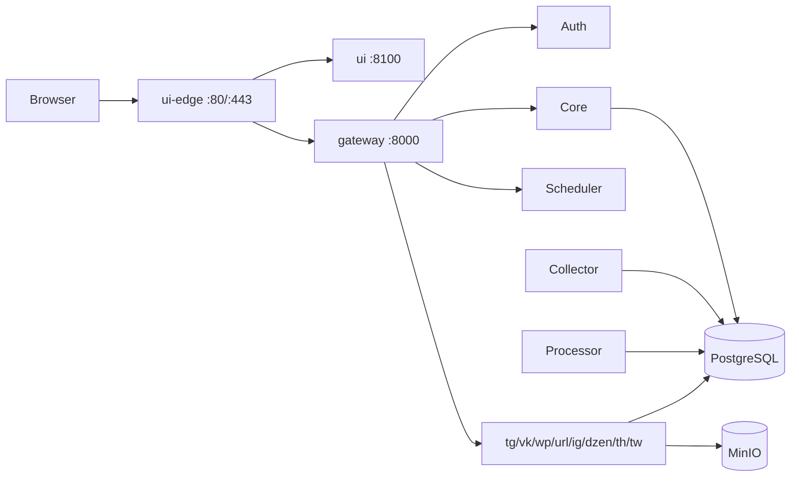

# CopyParse

Платформа кросспостинга и SMM: сбор, обработка и публикация контента в Telegram, VK, Instagram, Threads, Twitter/X, WordPress, Яндекс Дзен и Custom URL.

## Документация

| Документ | Содержание |
|----------|------------|
| [docs/ARCHITECTURE.md](docs/ARCHITECTURE.md) | Графы архитектуры, порты, пайплайн постов |
| [docs/INSTALLATION.md](docs/INSTALLATION.md) | Установка и локальный запуск |
| [docs/SECURITY_HARDENING.md](docs/SECURITY_HARDENING.md) | Секреты, порты, auth, нагрузка |
| [docs/USER_GUIDE.md](docs/USER_GUIDE.md) | Инструкция для пользователя UI |
| [docs/SERVICES_OVERVIEW.md](docs/SERVICES_OVERVIEW.md) | API Gateway, эндпоинты, БД |
| [docs/POSTS_LIFECYCLE.md](docs/POSTS_LIFECYCLE.md) | Статусы `posts` / `*_posts` |
| [docs/PERSONAL_BRAND.md](docs/PERSONAL_BRAND.md) | Личный бренд: учебный сезон TG (Python/React/Minikube), без блога на copyparse.ru |
| [deploy/DEPLOYMENT.md](deploy/DEPLOYMENT.md) | Прод: ui-edge, copyparse, 9to18 |
| [deploy/README.md](deploy/README.md) | Standalone compose-юниты вне основного UI |
| [k8s/README.md](k8s/README.md) | Kubernetes / Minikube |
| [config.md](config.md) | Переменные окружения сервисов |

## Архитектура (кратко)



Полные схемы: [docs/ARCHITECTURE.md](docs/ARCHITECTURE.md).

## Быстрый старт

```powershell
copy .env.example .env
# DATABASE_URL, JWT/SECRET (openssl rand -hex 32), MinIO,
# GAME_BOT_TOKEN (BotFather), GAME_ADMIN_API_TOKEN

.\deploy\scripts\create-edge-net.ps1
docker compose up -d --build                    # полный стек (все сервисы)
# docker compose up -d --no-deps --build --force-recreate
# python deploy/scripts/compose_up_sequential.py   # поочерёдно, меньше пик RAM
```

- UI: http://127.0.0.1:8100  
- Gateway: http://127.0.0.1:8000/health  

Локально с edge + 9to18:

```powershell
docker compose -f docker-compose.yaml -f docker-compose.dev.yaml up -d
```

Подробно: [docs/INSTALLATION.md](docs/INSTALLATION.md).

## Три деплой-юнита вне основного стека

См. [deploy/README.md](deploy/README.md). Кратко:

| Юнит | Compose | Порты |
|------|---------|-------|
| copyparse (монорепо) | `docker-compose.yaml` | UI 8100, API 8000, боты, MinIO, Ollama |
| ui-9to18 | `deploy/ui-9to18/docker-compose.yml` | :8200 (edge_net) |
| ui-edge | `deploy/ui-edge/docker-compose.yml` | :80 / :443 |
| e2e-tester (опционально) | `deploy/e2e-tester/docker-compose.yml` | 127.0.0.1:8300 |

Сеть `edge_net` создаётся скриптом `deploy/scripts/create-edge-net.ps1` (или `.sh`).

## Стек

- Python 3.12+, FastAPI, PostgreSQL 16, MinIO (S3), Ollama (AI)
- React + Vite (ui-app)
- Боты: Telethon, Selenium/Chromium где нужно, платформенные API

## Платформы

Telegram · VKontakte · Instagram · Threads · Twitter/X · WordPress · Яндекс Дзен · Custom URL
