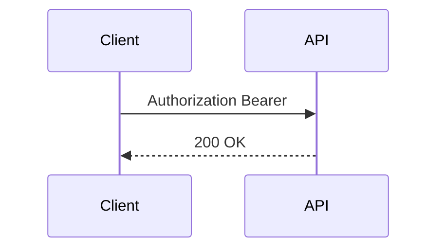

## Введение

Кратко опишите тему выпуска и зачем она нужна на собеседовании или в работе. Минимум ~40 символов.

## Раздел: Access vs refresh

Текст теории. Можно несколько разделов — каждый начинается с `## Раздел: …`.

## Лаба

**Цель.** …

**Шаги.**
1. …

**В группу:** …

**Готово, если…**
- [ ] …

## Схема: Поток токена

## Тест

### Что лежит в payload JWT?

**Ответ:** claims

**Пояснение:** не секреты, а утверждения.

### Зачем нужен refresh-токен?

**Ответ:** обновить access без повторного логина

**Пояснение:** access живёт коротко, refresh — дольше и хранится осторожнее.

### Можно ли хранить JWT в localStorage?

**Ответ:** риск XSS

**Пояснение:** часто безопаснее httpOnly cookie при контроле CSRF.

## Шпаргалка

<h3>Суть</h3>
<ul>
<li>header.payload.signature</li>
<li>подписываем, не шифруем</li>
</ul>
<h3>Команды / формулы</h3>
<pre><code>Authorization: Bearer &lt;token&gt;</code></pre>

## Anki

### Front: Из чего состоит JWT?

Back: header, payload, signature

### Front: Чем access отличается от refresh?

Back: access короткий для API; refresh длиннее для обновления сессии

### Front: Что нельзя класть в payload?

Back: секреты и пароли — payload читается без ключа

## Итоги

- Подписываем, не шифруем
- Короткий access + осторожный refresh
- XSS и storage — частый вопрос на собесе

## Ссылки

- [RFC 7519](https://datatracker.ietf.org/doc/html/rfc7519)
- Learn | /game/learn
