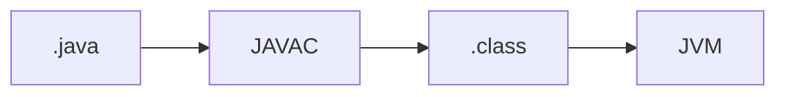

## Введение

Первый выпуск трека Java: что исполняет байткод и чем JDK отличается от JRE.

## Раздел: Основы

JDK включает компилятор и инструменты; JRE — среда запуска; JVM исполняет bytecode.

## Раздел: Практика

Classpath указывает, где искать классы. Примитивы (int) хранят значение; ссылочные типы — ссылку на объект в heap.

## Раздел: На собесе

На собесе: «Java компилируется в bytecode, не в нативный код напрямую (если не считать JIT)».

## Лаба

**Цель.** Объяснить цепочку .java → javac → .class → JVM.

**Шаги.**
1. Напишите одну фразу JDK vs JRE.
2. Объясните classpath.
3. Приведите пример примитива и ссылочного типа.
4. Что делает JIT кратко?
5. Сравните с интерпретатором Python (см. PY01).

**В группу:** партнёр путает JDK и JVM — поправьте.

**Готово, если…**
- [ ] Отличаете JDK/JRE/JVM
- [ ] Знаете classpath
- [ ] Примитив vs reference

## Схема: Компиляция

## Тест

### JDK vs JRE?

**Ответ:** JDK = tools+compiler; JRE = runtime

**Пояснение:** JVM входит в оба как исполнитель.

### Где ищутся классы?

**Ответ:** classpath / module path

**Пояснение:** Ошибка ClassNotFound часто от неверного пути.

### int и Integer?

**Ответ:** примитив vs объект-обёртка

**Пояснение:** Autoboxing связывает их.

## Шпаргалка

<h3>Стек</h3><ul><li>JDK → JRE → JVM</li><li>bytecode + JIT</li></ul>

## Anki

### Front: JDK

Back: development kit с javac

### Front: JVM

Back: исполняет bytecode

### Front: classpath

Back: поиск классов

## Итоги

- Bytecode, не «чистый интерпретатор»
- Classpath — частая боль
- Связка с PY01 уместна

## Ссылки

- Learn | [PY01 Intro Python](/game/learn/py-intro-python)
- Далее: [ООП Java vs Python](/game/learn/jv-oop-vs-python)
