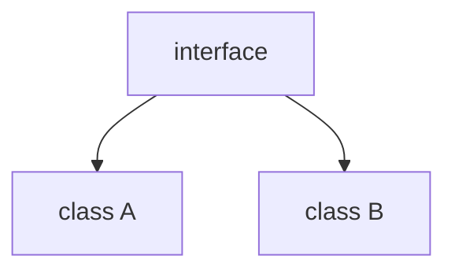

## Введение

Сравнение моделей ООП помогает разработчикам с Python-трека.

## Раздел: Основы

В Java всё (почти) в классах; interface — контракт; class может реализовать несколько interface.

## Раздел: Практика

static принадлежит типу, не экземпляру. См. [py-oop-basics](/game/learn/py-oop-basics).

## Раздел: На собесе

На собесе: не спорьте «что лучше» — покажите, где семантика совпадает и где нет (duck typing vs interface).

## Лаба

**Цель.** Сопоставить interface Java и Protocol/ABC Python.

**Шаги.**
1. Напишите мини-interface Drawable.
2. Реализуйте class Circle.
3. Где static уместен?
4. Чем interface отличается от abstract class (кратко)?
5. Ссылка на PY06.

**В группу:** один пишет Java-формулировку, второй — Python-аналог.

**Готово, если…**
- [ ] interface vs class
- [ ] static понятен
- [ ] Мост к PY06

## Схема: Контракт

## Тест

### interface это?

**Ответ:** контракт без (полной) реализации

**Пояснение:** default-методы с Java 8 — исключение.

### static метод

**Ответ:** принадлежит классу

**Пояснение:** Вызов через ИмяКласса.method.

### Связь с Python

**Ответ:** ABC/Protocol ≈ контракт

**Пояснение:** Duck typing слабее формальных интерфейсов.

## Шпаргалка

<h3>Мост</h3><ul><li>interface ↔ Protocol</li><li>class ↔ class</li></ul>

## Anki

### Front: interface

Back: контракт

### Front: static

Back: на типе

### Front: PY06

Back: база ООП Python

## Итоги

- Контракты явны в Java
- Не демонизируйте Python
- Ссылки кросс-серий

## Ссылки

- Learn | [PY06 ООП](/game/learn/py-oop-basics)
- Далее: [Shell и процесс](/game/learn/jv-shell-process)
