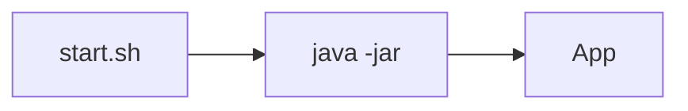

## Введение

Запуск сервиса — часть работы Java-разработчика; глубокий Linux — в QA17.

## Раздел: Основы

Процесс JVM: `java -jar app.jar`. Переменные окружения (`JAVA_OPTS`, `DB_URL`) конфигурируют поведение.

## Раздел: Практика

Скрипт: проверка Java version, выставление heap `-Xmx`, логирование PID. См. [qa-infra-linux-containers](/game/learn/qa-infra-linux-containers).

## Раздел: На собесе

На собесе: уметь прочитать `ps`/`top` и логи — достаточно junior/middle без роли админа.

## Лаба

**Цель.** Написать bash-обёртку запуска jar.

**Шаги.**
1. echo $JAVA_HOME.
2. java -version.
3. Скрипт start.sh с -Xmx256m.
4. Куда смотреть логи (stdout/файл)?
5. Ссылка на QA17.

**В группу:** партнёр ломает JAVA_HOME — вы диагностируете.

**Готово, если…**
- [ ] Запускаете jar
- [ ] Знаете JAVA_OPTS
- [ ] Ссылаетесь на QA17

## Схема: Старт

## Тест

### Как задать heap?

**Ответ:** -Xmx / -Xms

**Пояснение:** Часто через JAVA_OPTS.

### Где глубокий Linux?

**Ответ:** QA17 infra

**Пояснение:** Не дублируем курс администрирования.

### Зачем PID?

**Ответ:** диагностика процесса, kill, метрики

**Пояснение:** ps/top/pidstat.

## Шпаргалка

<h3>Запуск</h3><pre><code>java -Xmx512m -jar app.jar</code></pre>

## Anki

### Front: -Xmx

Back: лимит heap

### Front: JAVA_OPTS

Back: опции JVM из env

### Front: QA17

Back: Linux/Docker для QA

## Итоги

- Скрипт тонкий
- Env > хардкод
- Кросс на QA17

## Ссылки

- Learn | [QA17 Linux](/game/learn/qa-infra-linux-containers)
- Далее: [JDBC basics](/game/learn/jv-jdbc-basics)
