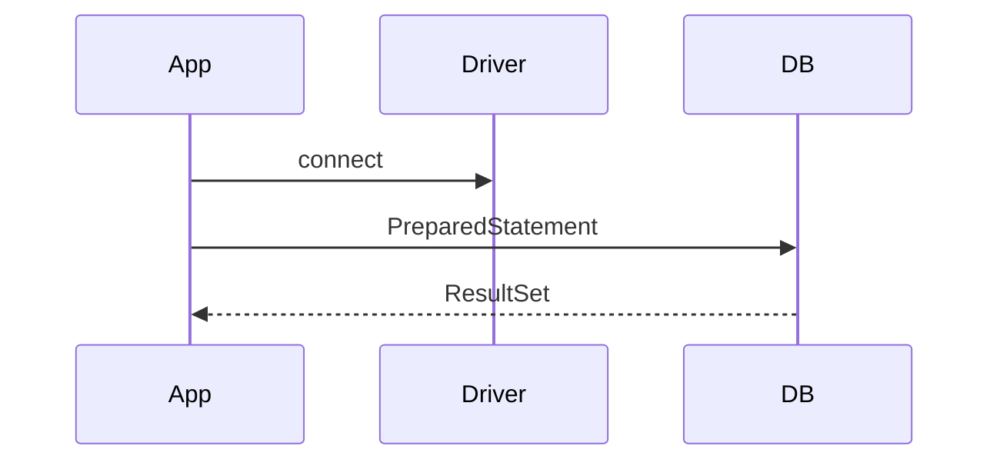

## Введение

JDBC — стандартный API доступа к реляционным БД из Java.

## Раздел: Основы

Driver регистрирует протокол. Connection — сессия с БД. Statement vs PreparedStatement: второй с плейсхолдерами защищает от SQL injection.

## Раздел: Практика

Типичный поток: getConnection → prepareStatement → setXxx → executeQuery/Update → close (try-with-resources).

## Раздел: На собесе

На собесе напишите псевдокод SELECT по id с `?`.

## Лаба

**Цель.** Псевдокод безопасного SELECT.

**Шаги.**
1. Откройте Connection (псевдокод).
2. PreparedStatement с WHERE id=?.
3. Почему не Statement + конкатенация?
4. Закрытие ресурсов.
5. Связь с SQL01.

**В группу:** один пишет уязвимый SQL, второй чинит PreparedStatement.

**Готово, если…**
- [ ] Driver/Connection
- [ ] PreparedStatement
- [ ] try-with-resources

## Схема: JDBC поток

## Тест

### Зачем PreparedStatement?

**Ответ:** плейсхолдеры и план/безопасность

**Пояснение:** Защита от injection.

### Connection это?

**Ответ:** сессия с СУБД

**Пояснение:** Держать пул на middle — JV05.

### SQL injection как лечить?

**Ответ:** параметры, не конкатенация

**Пояснение:** Аналог placeholders в Python.

## Шпаргалка

<h3>Каркас</h3><pre><code>try (Connection c = ...;
     PreparedStatement ps = c.prepareStatement(sql)) {
  ps.setLong(1, id);
}</code></pre>

## Anki

### Front: PreparedStatement

Back: SQL с ?

### Front: ResultSet

Back: курсор результата

### Front: injection

Back: лечить параметрами

## Итоги

- JDBC = фундамент ORM
- Параметры обязательны
- Ресурсы закрывать

## Ссылки

- Learn | [SQL01](/game/learn/sql-ddl-dml-dcl)
- Далее: [Пул и транзакции](/game/learn/jv-jdbc-pool-tx)
