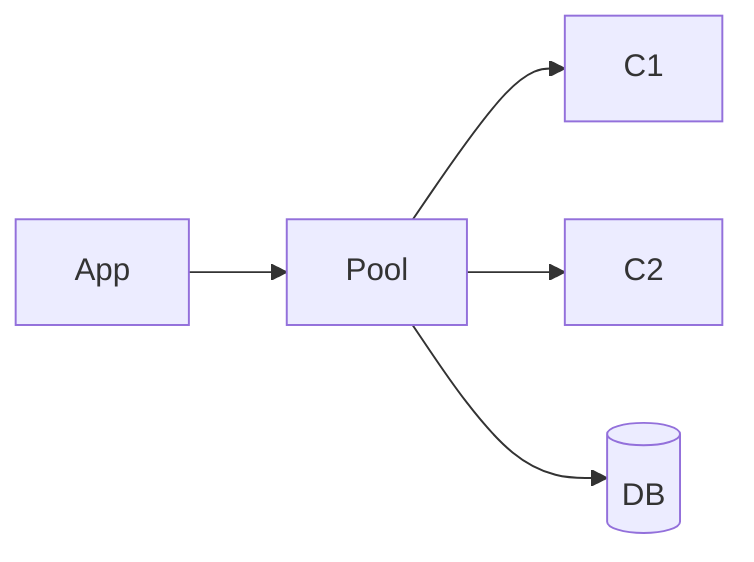

## Введение

Открывать Connection на каждый запрос без пула — дорого. Транзакции связывают несколько DML.

## Раздел: Основы

Пул (HikariCP и др.) держит готовые соединения. autocommit=true — каждый statement сам по себе; false — явный commit/rollback.

## Раздел: Практика

См. [sql-acid-transactions](/game/learn/sql-acid-transactions).

## Раздел: На собесе

На собесе: «пул ограничивает число соединений к БД и снижает latency connect».

## Лаба

**Цель.** Описать границы транзакции перевода денег.

**Шаги.**
1. Зачем пул?
2. autocommit false — когда?
3. ROLLBACK при ошибке.
4. Риск утечки соединений.
5. Ссылка SQL08.

**В группу:** разберите deadlock на двух обновлениях.

**Готово, если…**
- [ ] Пул понятен
- [ ] commit/rollback
- [ ] Связь с ACID

## Схема: Пул

## Тест

### Зачем pool?

**Ответ:** переиспользование соединений

**Пояснение:** Меньше handshake/нагрузки.

### autocommit false

**Ответ:** явные границы транзакции

**Пояснение:** Несколько DML атомарно.

### Утечка Connection

**Ответ:** не вернули в пул / не закрыли

**Пояснение:** Исчерпание пула.

## Шпаргалка

<h3>Tx</h3><pre><code>c.setAutoCommit(false);
// DML
c.commit();</code></pre>

## Anki

### Front: pool

Back: кэш соединений

### Front: rollback

Back: откат tx

### Front: SQL08

Back: ACID канон

## Итоги

- Пул = must-have
- Tx на уровне приложения
- Читайте SQL08

## Ссылки

- Learn | [SQL08 ACID](/game/learn/sql-acid-transactions)
- Далее: [ORM concepts](/game/learn/jv-orm-concepts)
