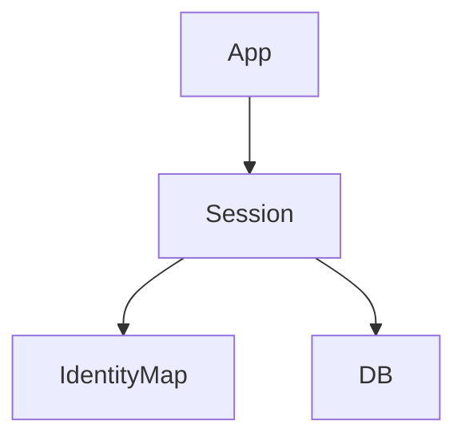

## Введение

ORM отображает таблицы на объекты. Важно понимать цены абстракции.

## Раздел: Основы

Identity map: один объект на один ключ в сессии. Dirty checking: изменения полей сами попадают в UPDATE.

## Раздел: Практика

Unit of work откладывает SQL до flush/commit. Raw SQL нужен для сложных отчётов и отладки N+1.

## Раздел: На собесе

См. Python-угол: [py-web-flask-django](/game/learn/py-web-flask-django), [py-db-cache-memcached](/game/learn/py-db-cache-memcached).

## Лаба

**Цель.** Сравнить JDBC INSERT и ORM persist.

**Шаги.**
1. Определите identity map.
2. Что такое dirty checking?
3. Когда raw SQL лучше?
4. Риск «магии» ORM.
5. Ссылка PY19/PY20.

**В группу:** партнёр хвалит только ORM — вы добавляете контраргумент.

**Готово, если…**
- [ ] Три понятия ORM
- [ ] Граница raw SQL
- [ ] Кросс на Python

## Схема: Сессия ORM

## Тест

### identity map

**Ответ:** один объект на PK в сессии

**Пояснение:** Избегает дублей экземпляров.

### dirty checking

**Ответ:** отслеживание изменённых полей

**Пояснение:** UPDATE без явного SQL.

### Когда JDBC?

**Ответ:** сложный SQL, перф, отладка

**Пояснение:** ORM не запрещает native query.

## Шпаргалка

<h3>ORM</h3><ul><li>identity map</li><li>dirty checking</li><li>unit of work</li></ul>

## Anki

### Front: identity map

Back: уникальность объекта в сессии

### Front: dirty checking

Back: авто-UPDATE

### Front: unit of work

Back: пакет изменений

## Итоги

- ORM ускоряет CRUD
- Понимайте SQL под ним
- N+1 — следующий выпуск

## Ссылки

- Learn | [PY19](/game/learn/py-web-flask-django)
- Learn | [PY20](/game/learn/py-db-cache-memcached)
- Далее: [JPA и N+1](/game/learn/jv-jpa-nplus1)
