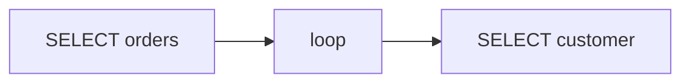

## Введение

JPA — спецификация; Hibernate — популярная реализация.

## Раздел: Основы

Entity связан с таблицей. FetchType.LAZY откладывает загрузку связей. N+1: 1 запрос список + N запросов связей в цикле.

## Раздел: Практика

Лечение: join fetch, entity graph, batch size. См. [sql-performance-explain](/game/learn/sql-performance-explain).

## Раздел: На собесе

На собесе нарисуйте N+1 на заказах и клиентах.

## Лаба

**Цель.** Найти N+1 в псевдокоде и предложить join fetch.

**Шаги.**
1. Список Order без join — сколько SQL?
2. Что такое lazy?
3. Как лечить N+1?
4. Связь с SQL14.
5. Лог SQL в dev.

**В группу:** один пишет антипаттерн, второй — фикс.

**Готово, если…**
- [ ] Видите N+1
- [ ] Знаете join fetch
- [ ] Ссылка SQL14

## Схема: N+1

## Тест

### N+1 это?

**Ответ:** 1+N запросов в цикле

**Пояснение:** Симптом ORM-ленивости.

### Лечение?

**Ответ:** join fetch / batch

**Пояснение:** Один наборный SQL.

### LAZY зачем?

**Ответ:** не тащить граф всегда

**Пояснение:** Но опасен вне сессии.

## Шпаргалка

<h3>N+1</h3><ul><li>лог SQL</li><li>join fetch</li><li>см. SQL14</li></ul>

## Anki

### Front: N+1

Back: цикл запросов

### Front: join fetch

Back: подтянуть связь одним SQL

### Front: SQL14

Back: планы и N+1

## Итоги

- Логируйте SQL
- LAZY осознанно
- Канон перфа — SQL14

## Ссылки

- Learn | [SQL14](/game/learn/sql-performance-explain)
- Далее: [JMS](/game/learn/jv-jms)
