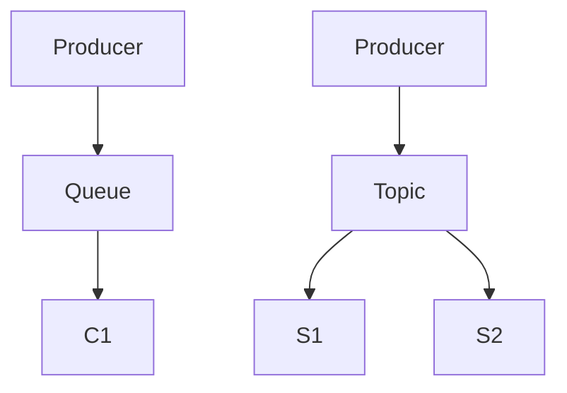

## Введение

JMS — API Java для брокеров. Не путать с Kafka client API.

## Раздел: Основы

Queue — competing consumers (одна задача — один consumer). Topic — pub/sub подписчикам.

## Раздел: Практика

Ack подтверждает обработку; DLQ — «мертвые» сообщения после ретраев. См. [sa-sync-async-queues](/game/learn/sa-sync-async-queues) для Kafka/Rabbit как концепций.

## Раздел: На собесе

На собесе: JMS = контракт Java; брокер может быть ActiveMQ/IBM MQ и т.д.

## Лаба

**Цель.** Выбрать queue или topic для сценария уведомлений.

**Шаги.**
1. Заказ на обработку одним воркером — ?
2. Рассылка события многим — ?
3. Зачем DLQ?
4. Что даёт ack?
5. Ссылка SA10.

**В группу:** сравните с Redis pub/sub (RD06).

**Готово, если…**
- [ ] queue vs topic
- [ ] ack/DLQ
- [ ] Мост к SA10

## Схема: JMS

## Тест

### Queue семантика?

**Ответ:** одно сообщение — один consumer

**Пояснение:** Competing consumers.

### Topic?

**Ответ:** fan-out подписчикам

**Пояснение:** Pub/sub модель.

### DLQ?

**Ответ:** хранилище ядовитых сообщений

**Пояснение:** После исчерпания retry.

## Шпаргалка

<h3>JMS</h3><ul><li>Queue / Topic</li><li>ack</li><li>DLQ</li></ul>

## Anki

### Front: queue

Back: точка-точка

### Front: topic

Back: pub/sub

### Front: DLQ

Back: dead letter

## Итоги

- JMS ≠ Kafka API
- Гарантии зависят от брокера
- Читайте SA10

## Ссылки

- Learn | [SA10](/game/learn/sa-sync-async-queues)
- Learn | [RD06](/game/learn/rd-pubsub-vs-queue)
- Далее: [ESB adapter](/game/learn/jv-esb-adapter)
