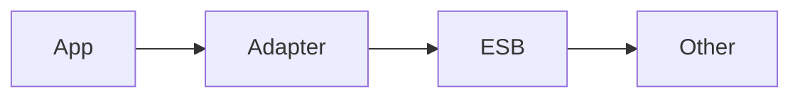

## Введение

Канон ESB — у аналитиков. Здесь — роль адаптера в коде.

## Раздел: Основы

Адаптер преобразует внутреннюю модель сервиса в каноническое сообщение шины и обратно.

## Раздел: Практика

Не тащите бизнес-логику в ESB «потому что можно». См. [sa-esb-integrations](/game/learn/sa-esb-integrations).

## Раздел: На собесе

На собесе: «я реализую producer/consumer контракта, аналитик выбирает ESB vs брокер».

## Лаба

**Цель.** Нарисовать границы app / adapter / ESB.

**Шаги.**
1. Что делает адаптер?
2. Где каноническая модель?
3. Почему не дублировать SA13?
4. Версия контракта.
5. Ссылка SA13/SA19.

**В группу:** роль: разработчик vs СА.

**Готово, если…**
- [ ] Границы адаптера
- [ ] Ссылка SA13
- [ ] Версионирование

## Схема: Адаптер

## Тест

### Адаптер зачем?

**Ответ:** маппинг в канон шины

**Пояснение:** Изоляция доменной модели.

### Канон теории ESB?

**Ответ:** SA13

**Пояснение:** Не копируем курс аналитика.

### Риск богатой шины?

**Ответ:** божественный узел

**Пояснение:** См. SA19 integration design.

## Шпаргалка

<h3>Роль</h3><ul><li>код = адаптер</li><li>выбор = SA</li></ul>

## Anki

### Front: adapter

Back: маппинг

### Front: SA13

Back: канон ESB

### Front: canonical model

Back: общая схема

## Итоги

- Тонкий адаптер
- Канон в SA
- Версии контрактов

## Ссылки

- Learn | [SA13](/game/learn/sa-esb-integrations)
- Learn | [SA19](/game/learn/sa-integration-design)
- Далее: [SOAP client](/game/learn/jv-soap-client)
