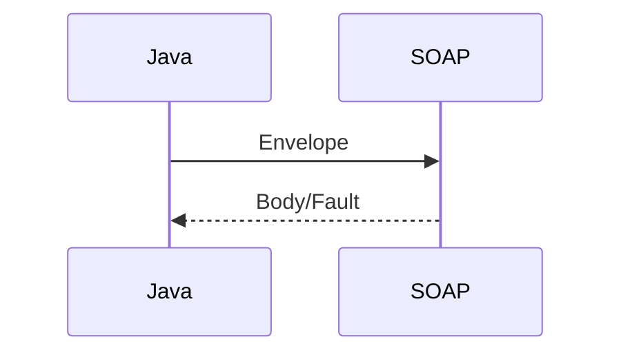

## Введение

Генерация stub из WSDL и вызов операции — типичный энтерпрайз.

## Раздел: Основы

WSDL описывает операции; клиент сериализует XML envelope. Ошибки — Fault.

## Раздел: Практика

Канон понятий: [sa-soap-xml](/game/learn/sa-soap-xml). Здесь не повторяем XSD-курс.

## Раздел: На собесе

На собесе честно: «контракт читаю из WSDL, маплю поля, логирую Fault».

## Лаба

**Цель.** Сопоставить SOAP-операцию с REST-аналогом.

**Шаги.**
1. Что даёт WSDL?
2. Где Fault?
3. Ссылка SA12.
4. Когда оставить SOAP?
5. Чем REST проще для нового API?

**В группу:** сверьте с таблицей SOAP vs REST из SA12.

**Готово, если…**
- [ ] WSDL→client
- [ ] Fault
- [ ] Ссылка SA12

## Схема: Вызов

## Тест

### WSDL?

**Ответ:** описание сервиса

**Пояснение:** Генерация клиента.

### Fault?

**Ответ:** ошибка SOAP

**Пояснение:** В Body или отдельный элемент.

### Канон теории?

**Ответ:** SA12

**Пояснение:** Не дублируем.

## Шпаргалка

<h3>Клиент</h3><ul><li>WSDL</li><li>stub</li><li>Fault</li></ul>

## Anki

### Front: WSDL

Back: паспорт сервиса

### Front: SA12

Back: SOAP/XML канон

### Front: Fault

Back: ошибка

## Итоги

- Stub из контракта
- Логируйте XML осторожно
- Теория в SA

## Ссылки

- Learn | [SA12](/game/learn/sa-soap-xml)
- Далее: [JS glue](/game/learn/jv-js-glue)
