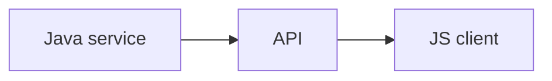

## Введение

В резюме архитекторов JS часто как скрипты/клей, не как React-курс.

## Раздел: Основы

Сценарии: админки, bookmarklets, Nashorn/GraalJS (легаси), фронт к API.

## Раздел: Практика

Языковой трек: серия JS01–JS06. React — B08.

## Раздел: На собесе

На собесе отделите «знаю JS» от «пишу SPA».

## Лаба

**Цель.** Перечислить 3 сценария JS рядом с Java.

**Шаги.**
1. Скрипт автоматизации UI.
2. Вызов REST из fetch.
3. Почему не заменять JVM бизнес-логику на JS в legacy без нужды?
4. Ссылка JS01.
5. Ссылка B08.

**В группу:** границы компетенций фронт/бек.

**Готово, если…**
- [ ] Сценарии клея
- [ ] Ссылка JS
- [ ] Не путать с React-треком

## Схема: Клей

## Тест

### JS рядом с Java зачем?

**Ответ:** UI/скрипты/клиент API

**Пояснение:** Не обязательно полный frontend stack.

### Куда за языком?

**Ответ:** JS01+

**Пояснение:** /game/learn/js-types-coerce

### React где?

**Ответ:** сезон B

**Пояснение:** B08 list.

## Шпаргалка

<h3>Граница</h3><ul><li>клей ≠ SPA-курс</li><li>см. JS series</li></ul>

## Anki

### Front: glue

Back: скрипты и клиент

### Front: JS01

Back: типы JS

### Front: B08

Back: React list

## Итоги

- Честные границы
- Ссылки на JS series
- API first

## Ссылки

- Learn | [JS01](/game/learn/js-types-coerce)
- Learn | [B08](/game/learn/b08-react-list)
- Далее: [JVM hosting](/game/learn/jv-jvm-hosting)
