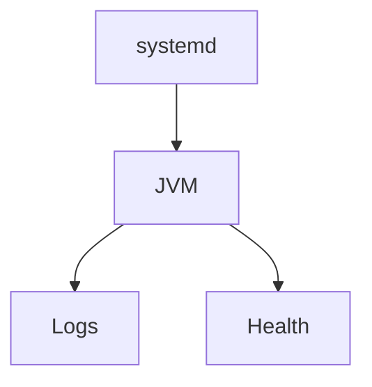

## Введение

Сервис должен переживать релогин и ребут.

## Раздел: Основы

Linux: unit systemd с Restart=on-failure. Windows/IIS: иногда Java как сервис/за reverse proxy.

## Раздел: Практика

Не повторяем курс контейнеров — см. QA17. Здесь — чеклист «процесс жив, порты, логи, health».

## Раздел: На собесе

На собесе: healthcheck URL + журнал + лимиты памяти.

## Лаба

**Цель.** Составить unit-файл-эскиз.

**Шаги.**
1. ExecStart java -jar.
2. Restart политика.
3. Куда логи?
4. Health endpoint.
5. Ссылка QA17.

**В группу:** сравните bare metal vs Docker одной фразой.

**Готово, если…**
- [ ] systemd эскиз
- [ ] health
- [ ] Ссылка QA17

## Схема: Сервис

## Тест

### Restart=on-failure?

**Ответ:** автоперезапуск при падении

**Пояснение:** Не маскирует корневой баг.

### Health зачем?

**Ответ:** оркестратор/балансер знает живость

**Пояснение:** Отдельно от «процесс есть».

### Глубокий Linux?

**Ответ:** QA17

**Пояснение:** Не дублируем.

## Шпаргалка

<h3>Хостинг</h3><ul><li>systemd/service</li><li>logs</li><li>health</li></ul>

## Anki

### Front: systemd

Back: менеджер сервисов

### Front: health

Back: проверка живости

### Front: QA17

Back: infra deep dive

## Итоги

- Процесс под супервизором
- Логи и метрики
- Кросс QA17

## Ссылки

- Learn | [QA17](/game/learn/qa-infra-linux-containers)
- Далее: [Integration lab](/game/learn/jv-integration-lab)
