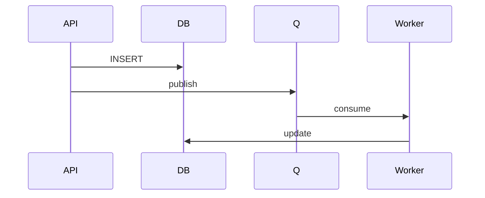

## Введение

Senior-лаба без продакшен-кода: связать JDBC и JMS.

## Раздел: Основы

Сценарий: приняли команду → записали статус в БД → опубликовали событие в очередь.

## Раздел: Практика

Идемпотентность consumer: повтор сообщения не создаёт дубль строки (unique key / upsert).

## Раздел: На собесе

Документируйте failure modes: БД ок / брокер упал и наоборот.

## Лаба

**Цель.** Спроектировать happy-path и 2 failure.

**Шаги.**
1. Таблица outbox или sync publish — выбор.
2. Ключ идемпотентности.
3. Порядок commit vs send.
4. DLQ политика.
5. Критерии Done лабы.

**В группу:** разберите dual-write проблему.

**Готово, если…**
- [ ] Есть схема контура
- [ ] Идемпотентность
- [ ] Failure modes

## Схема: Контур

## Тест

### Dual-write риск?

**Ответ:** БД и брокер расходятся

**Пояснение:** Outbox/паттерны согласованности.

### Идемпотентность?

**Ответ:** повтор без дубля эффекта

**Пояснение:** Ключ операции.

### Зачем лаба?

**Ответ:** собрать JDBC+JMS в одну историю

**Пояснение:** Senior синтез.

## Шпаргалка

<h3>Лаба</h3><ul><li>write</li><li>publish</li><li>consume idempotent</li></ul>

## Anki

### Front: outbox

Back: событие из БД

### Front: idempotent

Back: безопасный повтор

### Front: DLQ

Back: ядовитые

## Итоги

- Сначала схема
- Потом код
- Думайте о повторах

## Ссылки

- Learn | [JMS](/game/learn/jv-jms)
- Learn | [JDBC](/game/learn/jv-jdbc-basics)
- Далее: [ADR bus vs broker](/game/learn/jv-adr-bus-vs-broker)
