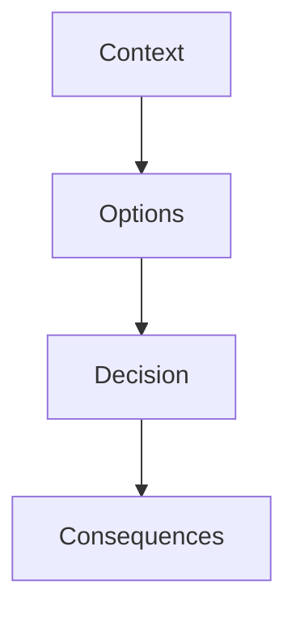

## Введение

Формат ADR — канон SA20; здесь пример решения для Java-контура.

## Раздел: Основы

Контекст: много легаси XML vs новый event-driven сервис. Варианты: ESB, Kafka, прямой REST.

## Раздел: Практика

См. [sa-architecture-decisions](/game/learn/sa-architecture-decisions) и [sa-integration-design](/game/learn/sa-integration-design).

## Раздел: На собесе

На собесе: структура Context / Options / Decision / Consequences.

## Лаба

**Цель.** Написать ADR на полстраницы.

**Шаги.**
1. Контекст.
2. 3 опции.
3. Решение.
4. Последствия + и −.
5. Ссылка SA20.

**В группу:** ревью ADR друг друга.

**Готово, если…**
- [ ] Структура ADR
- [ ] Ссылки SA
- [ ] Честные последствия

## Схема: ADR

## Тест

### ADR зачем?

**Ответ:** зафиксировать почему

**Пояснение:** Через полгода не гадать.

### Канон формата?

**Ответ:** SA20

**Пояснение:** Не изобретаем шаблон.

### ESB всегда?

**Ответ:** нет

**Пояснение:** См. антипаттерн SA19.

## Шпаргалка

<h3>ADR</h3><ul><li>Context</li><li>Options</li><li>Decision</li><li>Consequences</li></ul>

## Anki

### Front: ADR

Back: architecture decision record

### Front: SA20

Back: канон ADR

### Front: SA19

Back: выбор интеграции

## Итоги

- Пишите коротко
- Ссылайтесь на SA
- Последствия важны

## Ссылки

- Learn | [SA20](/game/learn/sa-architecture-decisions)
- Learn | [SA19](/game/learn/sa-integration-design)
- Далее: [Interview drill](/game/learn/jv-interview-drill)
