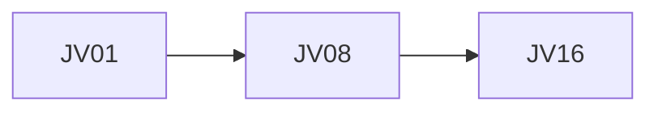

## Введение

Итог трека: от JVM до интеграций.

## Раздел: Основы

Junior: JVM, OOP, shell, JDBC, pool, ORM concepts. Middle: JPA/N+1, JMS, ESB adapter, SOAP client, JS glue, hosting. Senior: lab, ADR, drill.

## Раздел: Практика

Индекс: jv-se-jvm … jv-capstone (см. SERIES.md).

## Раздел: На собесе

Связки: SQL, SA, QA17, JS, PY.

## Лаба

**Цель.** Собрать персональный чеклист ❌/✅.

**Шаги.**
1. Пройти SERIES.
2. Отметить пробелы.
3. Повторить 3 лабы.
4. Добавить pet-проект контур.
5. Готово к собесу.

**В группу:** взаимная проверка чеклистов.

**Готово, если…**
- [ ] Чеклист заполнен
- [ ] Индекс slug
- [ ] Кросс-серии отмечены

## Схема: Трек

## Тест

### С чего начать повтор?

**Ответ:** gap-list drill

**Пояснение:** Не с JV01 всегда.

### Где теория ESB?

**Ответ:** SA13

**Пояснение:** JV09 только адаптер.

### Где N+1 SQL?

**Ответ:** SQL14

**Пояснение:** JV07 мост.

## Шпаргалка

<h3>Чеклист</h3><ul><li>JDBC</li><li>ORM/N+1</li><li>JMS</li><li>ADR</li></ul>

## Anki

### Front: JV04

Back: jdbc basics

### Front: JV08

Back: jms

### Front: JV14

Back: ADR

## Итоги

- Трек закрыт картой
- Не дублируйте SA
- Практика > зубрёжка

## Ссылки

- Learn | [SERIES](/game/learn)
- Learn | [SA13](/game/learn/sa-esb-integrations)
