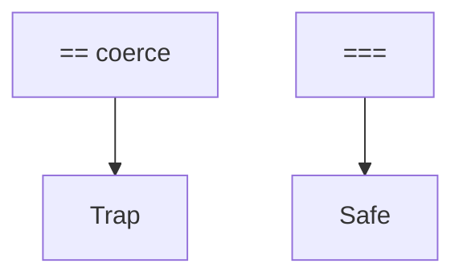

## Введение

База языка до DOM и React.

## Раздел: Основы

Примитивы: number, string, boolean, null, undefined, symbol, bigint. typeof null === 'object' — ловушка.

## Раздел: Практика

== делает coerce; === строго. Falsy: 0, '', null, undefined, NaN, false.

## Раздел: На собесе

На собесе предпочитайте === и явные преобразования.

## Лаба

**Цель.** Разобрать 5 выражений ==/===.

**Шаги.**
1. 0 == false?
2. 0 === false?
3. null == undefined?
4. typeof null?
5. Список falsy.

**В группу:** блэйц-квиз на coerce.

**Готово, если…**
- [ ] === default
- [ ] Знаете falsy
- [ ] typeof null trap

## Схема: Сравнение

## Тест

### === vs ==?

**Ответ:** строгое без coerce vs с coerce

**Пояснение:** Берите ===.

### falsy примеры?

**Ответ:** 0 '' null undefined NaN false

**Пояснение:** Не путать с false только.

### typeof null?

**Ответ:** 'object' (историческая ошибка)

**Пояснение:** Проверка null через === null.

## Шпаргалка

<h3>Типы</h3><ul><li>===</li><li>falsy</li><li>typeof null</li></ul>

## Anki

### Front: ===

Back: строгое равенство

### Front: falsy

Back: приводятся к false

### Front: typeof null

Back: object

## Итоги

- Строгие сравнения
- Явные convert
- Дальше функции

## Ссылки

- Learn | [QA06 JS фраза](/game/learn/qa-web-http-api-basics)
- Далее: [Functions](/game/learn/js-functions-this)
