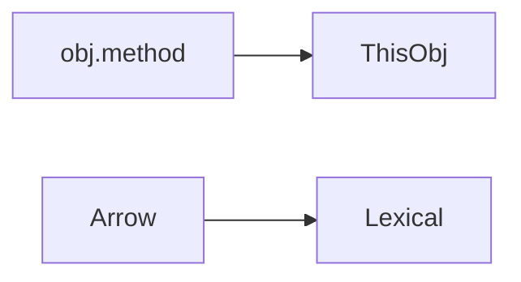

## Введение

Функции — граждане первого класса.

## Раздел: Основы

function declaration/expression; arrow не имеет своего this (лексический).

## Раздел: Практика

this зависит от способа вызова (объект, call/apply, new). В стрелках — извне.

## Раздел: На собесе

На собесе приведите пример потери this в колбэке.

## Лаба

**Цель.** Починить this в обработчике.

**Шаги.**
1. Обычная function this.
2. Arrow this.
3. bind.
4. Когда arrow удобен.
5. Когда нет.

**В группу:** найдите баг с this.

**Готово, если…**
- [ ] Разница function/arrow
- [ ] this сценарий
- [ ] bind

## Схема: this

## Тест

### arrow this?

**Ответ:** лексический извне

**Пояснение:** Нет своего this.

### bind зачем?

**Ответ:** зафиксировать this

**Пояснение:** Часто в колбэках.

### first-class?

**Ответ:** функции как значения

**Пояснение:** Передача/возврат.

## Шпаргалка

<h3>this</h3><ul><li>call site</li><li>arrow lexical</li><li>bind</li></ul>

## Anki

### Front: arrow

Back: короткий синтаксис + lexical this

### Front: bind

Back: фиксация this

### Front: call site

Back: как вызвали

## Итоги

- Понимайте call site
- Arrow не везде
- Дальше async

## Ссылки

- Learn | [JS01](/game/learn/js-types-coerce)
- Далее: [Async fetch](/game/learn/js-async-fetch)
