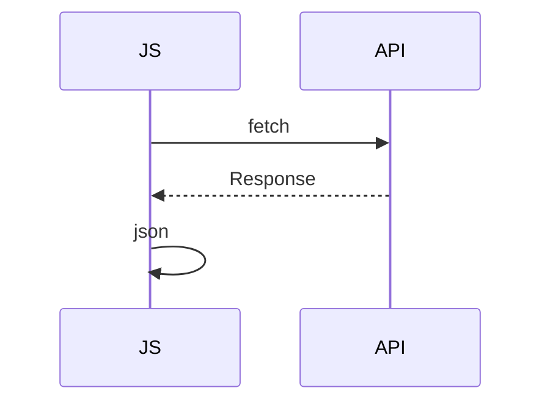

## Введение

Сетевые запросы не блокируют UI поток ожиданием в лоб.

## Раздел: Основы

Promise: pending/fulfilled/rejected. async/await — синтаксис над Promise.

## Раздел: Практика

fetch возвращает Promise; проверяйте response.ok. Ошибки сети ≠ HTTP 4xx/5xx без проверки.

## Раздел: На собесе

Связь с Python asyncio — другая модель; здесь браузерный клиент.

## Лаба

**Цель.** Написать async функцию загрузки JSON.

**Шаги.**
1. fetch url.
2. await res.json().
3. Проверка ok.
4. try/catch.
5. Что с 404?

**В группу:** сломайте URL и обработайте.

**Готово, если…**
- [ ] Promise состояния
- [ ] await
- [ ] ok check

## Схема: fetch

## Тест

### fetch сразу данные?

**Ответ:** нет, Response; нужен json()

**Пояснение:** Два await часто.

### 404 это throw?

**Ответ:** не всегда; смотрите ok

**Пояснение:** fetch не throw на HTTP error по умолчанию.

### async функция возвращает?

**Ответ:** Promise

**Пояснение:** Даже если return value.

## Шпаргалка

<h3>async</h3><pre><code>const r = await fetch(url);
if (!r.ok) throw …;
return r.json();</code></pre>

## Anki

### Front: Promise

Back: результат позже

### Front: await

Back: ждать Promise

### Front: ok

Back: HTTP успех

## Итоги

- Проверяйте ok
- Ловите ошибки
- Дальше DOM

## Ссылки

- Learn | [JS02](/game/learn/js-functions-this)
- Далее: [DOM](/game/learn/js-dom-events)
