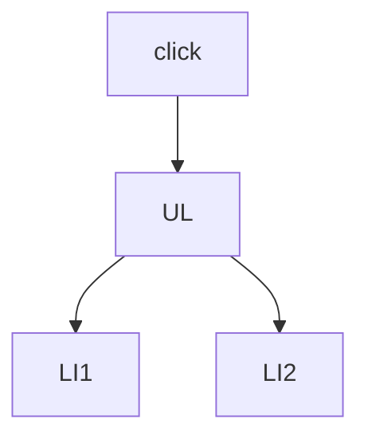

## Введение

QA смотрит DOM в DevTools; разработчик меняет его скриптом.

## Раздел: Основы

document.querySelector; textContent vs innerHTML (XSS риск).

## Раздел: Практика

addEventListener; делегирование на родителе для списка элементов.

## Раздел: На собесе

См. [qa-web-http-api-basics](/game/learn/qa-web-http-api-basics).

## Лаба

**Цель.** Повесить делегированный click на список.

**Шаги.**
1. Разметка ul/li.
2. listener на ul.
3. event.target.
4. Почему не N listeners.
5. XSS через innerHTML.

**В группу:** QA ищет селектор — dev объясняет.

**Готово, если…**
- [ ] querySelector
- [ ] delegation
- [ ] XSS caution

## Схема: Delegation

## Тест

### delegation зачем?

**Ответ:** один listener на родителя

**Пояснение:** Динамические списки.

### innerHTML риск?

**Ответ:** XSS

**Пояснение:** Предпочтительнее textContent/safe API.

### DevTools роль QA?

**Ответ:** смотреть DOM/сеть

**Пояснение:** QA06.

## Шпаргалка

<h3>DOM</h3><ul><li>querySelector</li><li>listener</li><li>delegate</li></ul>

## Anki

### Front: delegation

Back: события на родителе

### Front: XSS

Back: внедрение скрипта

### Front: QA06

Back: web basics

## Итоги

- Безопасное обновление DOM
- Делегирование
- Кросс QA

## Ссылки

- Learn | [QA06](/game/learn/qa-web-http-api-basics)
- Далее: [JSON/XML](/game/learn/js-json-xml)
