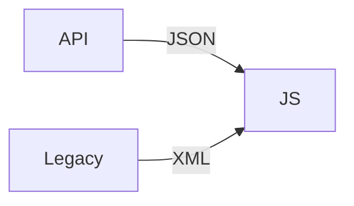

## Введение

Клиент чаще говорит JSON; XML жив в энтерпрайзе.

## Раздел: Основы

JSON.parse / stringify; ловите SyntaxError. Не доверяйте данным с сервера слепо.

## Раздел: Практика

XML: DOMParser; канон интеграций — [sa-soap-xml](/game/learn/sa-soap-xml). Python json — [py-stdlib-re-json-copy](/game/learn/py-stdlib-re-json-copy).

## Раздел: На собесе

На собесе: JSON = JS object notation subset; не путать с JS объектом циклическим.

## Лаба

**Цель.** Спарсить JSON и сравнить с XML-деревом идеей.

**Шаги.**
1. stringify объекта.
2. parse строки.
3. Ошибка parse.
4. Когда XML.
5. Ссылки SA12/PY08.

**В группу:** дайте битый JSON.

**Готово, если…**
- [ ] parse/stringify
- [ ] ошибки
- [ ] Ссылки

## Схема: Форматы

## Тест

### JSON.parse на битом?

**Ответ:** SyntaxError

**Пояснение:** try/catch.

### XML канон теории?

**Ответ:** SA12

**Пояснение:** Не дублируем SOAP курс.

### циклы в stringify?

**Ответ:** TypeError без replacer

**Пояснение:** Нужна осторожность.

## Шпаргалка

<h3>JSON</h3><pre><code>JSON.parse(text)
JSON.stringify(obj)</code></pre>

## Anki

### Front: parse

Back: строка→значение

### Front: stringify

Back: значение→строка

### Front: SA12

Back: XML/SOAP

## Итоги

- JSON по умолчанию в вебе
- XML — легаси/B2B
- Валидируйте вход

## Ссылки

- Learn | [SA12](/game/learn/sa-soap-xml)
- Learn | [PY08](/game/learn/py-stdlib-re-json-copy)
- Далее: [Capstone](/game/learn/js-capstone)
