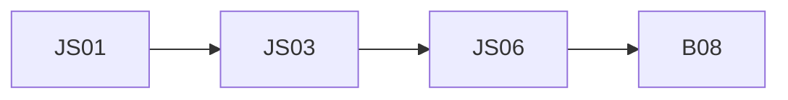

## Введение

Закрывающий выпуск языка JS.

## Раздел: Основы

Чеклист: типы, функции/this, async/fetch, DOM, JSON/XML.

## Раздел: Практика

Дальше UI-компоненты: [b08-react-list](/game/learn/b08-react-list).

## Раздел: На собесе

Индекс slug — SERIES.md.

## Лаба

**Цель.** Drill 8 вопросов + открыть B08.

**Шаги.**
1. ===.
2. arrow this.
3. fetch ok.
4. delegation.
5. JSON parse.
6. Gap-list.
7. Ссылка B08.
8. Готово.

**В группу:** парный drill.

**Готово, если…**
- [ ] Чеклист
- [ ] Мост React
- [ ] Gaps закрыты

## Схема: Трек JS

## Тест

### Куда после языка?

**Ответ:** React B08

**Пояснение:** Компоненты поверх API.

### Главный coerce совет?

**Ответ:** ===

**Пояснение:** JS01.

### Главный fetch совет?

**Ответ:** проверять ok

**Пояснение:** JS03.

## Шпаргалка

<h3>Чеклист</h3><ul><li>types</li><li>this</li><li>async</li><li>DOM</li><li>JSON</li></ul>

## Anki

### Front: JS01

Back: types

### Front: JS03

Back: fetch

### Front: B08

Back: React list

## Итоги

- Язык отделён от React
- Drill обязателен
- Дальше B08

## Ссылки

- Learn | [B08 React](/game/learn/b08-react-list)
