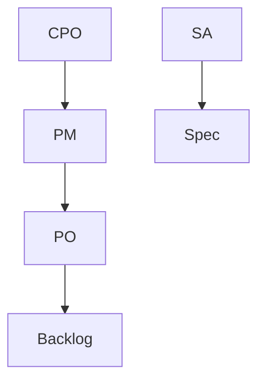

## Введение

Кто отвечает за ценность продукта и чем роль отличается от системного аналитика.

## Раздел: Основы

Product Management — цикл discovery→delivery→measure. CPO/Head of Product задаёт портфель и стратегию.

## Раздел: Практика

Scrum Product Owner владеет backlog в фреймворке Scrum; PM шире (go-to-market, P&L, стратегия).

## Раздел: На собесе

СА проясняет требования и интеграции; не подменяет приоритет ценности (см. SA22).

## Лаба

**Цель.** Развести PM, PO, СА на примере фичи оплаты.

**Шаги.**
1. Кто приоритет ценности?
2. Кто пишет постановку интеграций?
3. Где CPO?
4. Риск смешения ролей.
5. Ссылка SA22.

**В группу:** роли в треугольнике.

**Готово, если…**
- [ ] Границы ролей
- [ ] Discovery vs Delivery
- [ ] Ссылка SA

## Схема: Роли

## Тест

### PM vs PO?

**Ответ:** PM шире продукта; PO — backlog в Scrum

**Пояснение:** Часто один человек совмещает.

### СА vs PM?

**Ответ:** ясность решения vs ценность/приоритет

**Пояснение:** Стык обязателен.

### Discovery?

**Ответ:** проверка проблемы до большой поставки

**Пояснение:** Интервью, эксперименты.

## Шпаргалка

<h3>Роли</h3><ul><li>ценность — PM/PO</li><li>ясность — СА</li></ul>

## Anki

### Front: PM

Back: ценность продукта

### Front: PO

Back: backlog Scrum

### Front: SA22

Back: уровни СА

## Итоги

- Не путайте роли
- Ценность ≠ спецификация
- Дальше приоритизация

## Ссылки

- Learn | [SA22](/game/learn/sa-profession-levels)
- Далее: [Приоритизация](/game/learn/pm-prioritization)
