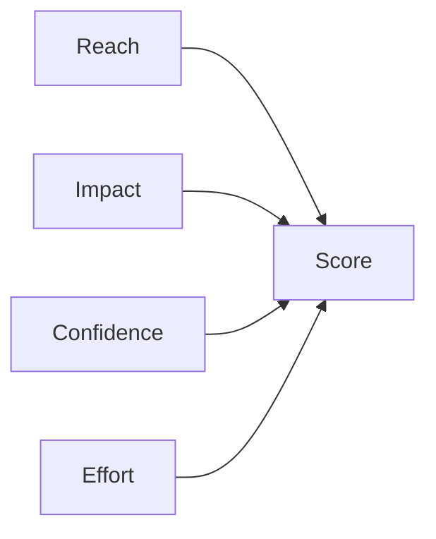

## Введение

Приоритет — явный trade-off, не «всем важно».

## Раздел: Основы

RICE: Reach, Impact, Confidence, Effort. WSJF: Cost of Delay / Job Size (SAFe).

## Раздел: Практика

См. также USM: [sa-user-stories-use-cases](/game/learn/sa-user-stories-use-cases); severity≠priority у QA: [qa-bugs-reports](/game/learn/qa-bugs-reports).

## Раздел: На собесе

На собесе покажите цифры и допущения Confidence.

## Лаба

**Цель.** Посчитать RICE для 3 фич.

**Шаги.**
1. Оцените Reach.
2. Impact 0.5–3.
3. Confidence %.
4. Effort person-months.
5. Сравните с WSJF идеей CoD.

**В группу:** поспорьте о Confidence.

**Готово, если…**
- [ ] Считаете RICE
- [ ] Знаете WSJF идею
- [ ] Ссылки SA/QA

## Схема: RICE

## Тест

### RICE формула?

**Ответ:** (R*I*C)/E

**Пояснение:** Effort в знаменателе.

### WSJF?

**Ответ:** Cost of Delay / размер

**Пояснение:** SAFe-приоритизация.

### QA priority vs product?

**Ответ:** срочность бага vs ценность фичи

**Пояснение:** Разные шкалы.

## Шпаргалка

<h3>RICE</h3><pre><code>(Reach * Impact * Confidence) / Effort</code></pre>

## Anki

### Front: RICE

Back: reach impact confidence / effort

### Front: WSJF

Back: CoD / size

### Front: USM

Back: SA02

## Итоги

- Цифры + допущения
- Не святой грааль
- Кросс SA/QA

## Ссылки

- Learn | [SA02](/game/learn/sa-user-stories-use-cases)
- Learn | [QA04](/game/learn/qa-bugs-reports)
- Далее: [CJM](/game/learn/pm-cjm)
