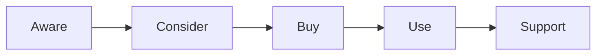

## Введение

CJM показывает путь клиента и точки боли.

## Раздел: Основы

Ось: этапы (узнал→купил→использует→поддерживает). На каждом: действия, эмоции, pain, метрика.

## Раздел: Практика

Связь с USM: [sa-user-stories-use-cases](/game/learn/sa-user-stories-use-cases). Упоминание в [sa-requirements-basics](/game/learn/sa-requirements-basics).

## Раздел: На собесе

CJM не заменяет backlog — питает его.

## Лаба

**Цель.** Набросать CJM для «оформить заказ».

**Шаги.**
1. 5 этапов.
2. Боль на оплате.
3. Метрика шага.
4. Гипотеза улучшения.
5. Ссылка SA01/SA02.

**В группу:** сверьте боли.

**Готово, если…**
- [ ] Есть карта
- [ ] Боль измерима
- [ ] Связь с USM

## Схема: CJM

## Тест

### CJM это?

**Ответ:** карта пути клиента

**Пояснение:** Этапы + боли + метрики.

### Связь с USM?

**Ответ:** оба про путь; USM ближе к backlog stories

**Пояснение:** SA02.

### Зачем метрика шага?

**Ответ:** увидеть где отвал

**Пояснение:** Conversion/time/NPS proxy.

## Шпаргалка

<h3>CJM</h3><ul><li>этапы</li><li>боли</li><li>метрики</li></ul>

## Anki

### Front: CJM

Back: customer journey map

### Front: pain

Back: боль этапа

### Front: USM

Back: story map

## Итоги

- Карта → гипотезы
- Не декорация
- Кросс SA

## Ссылки

- Learn | [SA01](/game/learn/sa-requirements-basics)
- Learn | [SA02](/game/learn/sa-user-stories-use-cases)
- Далее: [Agile PO](/game/learn/pm-agile-po)
