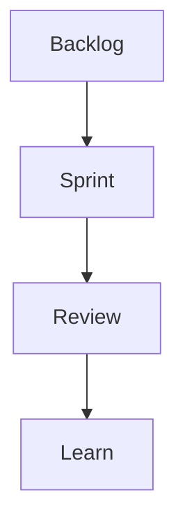

## Введение

PO не «пишет задачи разработчикам», а владеет порядком ценности.

## Раздел: Основы

Backlog упорядочен; Sprint Goal; Review принимает инкремент. DoR/DoD — канон [sa-methods-scrum-kanban](/game/learn/sa-methods-scrum-kanban), [qa-agile-scrum-kanban](/game/learn/qa-agile-scrum-kanban).

## Раздел: Практика

Антипаттерн: PO как проектор чужих хотелок без trade-off.

## Раздел: На собесе

На собесе покажите, как отказываете от scope в пользу Sprint Goal.

## Лаба

**Цель.** Собрать DoD для фичи «экспорт отчёта».

**Шаги.**
1. 3 пункта DoD.
2. DoR для story.
3. Что на Review?
4. Отказ от scope — пример.
5. Ссылки SA08/QA16.

**В группу:** сыграйте Review.

**Готово, если…**
- [ ] DoR/DoD
- [ ] Роль PO
- [ ] Ссылки Agile

## Схема: Scrum PO

## Тест

### DoD?

**Ответ:** Definition of Done инкремента

**Пояснение:** Общее для команды.

### PO антипаттерн?

**Ответ:** сборщик хотелок без приоритета

**Пояснение:** Нужен trade-off.

### Канон Scrum?

**Ответ:** SA08 / QA16

**Пояснение:** Не дублируем курс.

## Шпаргалка

<h3>PO</h3><ul><li>backlog order</li><li>DoR/DoD</li><li>Review</li></ul>

## Anki

### Front: DoD

Back: критерий готовности

### Front: DoR

Back: готовность взять в спринт

### Front: SA08

Back: Scrum канон

## Итоги

- Ценность в порядке backlog
- DoD общий
- Читайте SA/QA

## Ссылки

- Learn | [SA08](/game/learn/sa-methods-scrum-kanban)
- Learn | [QA16](/game/learn/qa-agile-scrum-kanban)
- Далее: [Strategy](/game/learn/pm-product-strategy)
