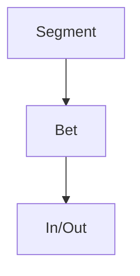

## Введение

Стратегия — выбор, а не wishlist.

## Раздел: Основы

Кто клиент, какая работа (JTBD), чем отличаемся, какие ставки на квартал.

## Раздел: Практика

Отказ от сегмента/фич — часть стратегии. Roadmap без стратегии — календарь желаний.

## Раздел: На собесе

Связь с OKR — следующий выпуск.

## Лаба

**Цель.** Описать стратегию pet-продукта на полстраницы.

**Шаги.**
1. Сегмент.
2. Ставка.
3. Что вне scope.
4. Риск ставки.
5. Метрика успеха.

**В группу:** атакуйте «мы для всех».

**Готово, если…**
- [ ] Есть ставка
- [ ] Есть отказ
- [ ] Метрика

## Схема: Ставка

## Тест

### Стратегия одной фразой?

**Ответ:** где играем и чем выигрываем

**Пояснение:** Плюс явный out-of-scope.

### Зачем отказ?

**Ответ:** фокус ресурсов

**Пояснение:** Иначе размазывание.

### Roadmap без стратегии?

**Ответ:** список хотелок

**Пояснение:** PM06 чинит формат.

## Шпаргалка

<h3>Strategy</h3><ul><li>segment</li><li>bet</li><li>out</li></ul>

## Anki

### Front: bet

Back: ставка

### Front: JTBD

Back: работа клиента

### Front: out-of-scope

Back: отказ

## Итоги

- Выбор > активность
- Пишите out
- Дальше roadmap

## Ссылки

- Learn | [PM01](/game/learn/pm-product-management)
- Далее: [Roadmapping](/game/learn/pm-roadmapping)
