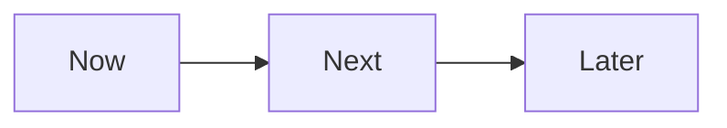

## Введение

Roadmap коммуницирует намерение, не контракт дат на год.

## Раздел: Основы

Now — текущий фокус; Next — кандидаты; Later — идеи. Даты — осторожно, с доверием к данным.

## Раздел: Практика

Не путать с roadmap автоматизации QA ([qa-shift-left-automation-roi](/game/learn/qa-shift-left-automation-roi)).

## Раздел: На собесе

Stakeholder ожидает честности про неопределённость.

## Лаба

**Цель.** Собрать Now/Next/Later для учебного продукта.

**Шаги.**
1. 3 Now.
2. 3 Next.
3. Later корзина.
4. Что сказать, если просят точную дату.
5. Связь со стратегией.

**В группу:** жёсткий стейкхолдер просит Гант.

**Готово, если…**
- [ ] Формат N/N/L
- [ ] Честность дат
- [ ] Не QA-roadmap

## Схема: NNL

## Тест

### Now/Next/Later?

**Ответ:** горизонты намерения

**Пояснение:** Гибче ложного Ганта.

### Почему не год дат?

**Ответ:** неопределённость discovery

**Пояснение:** Обещания разрушают доверие.

### QA roadmap?

**Ответ:** другой артефакт

**Пояснение:** QA20 про автоматизацию.

## Шпаргалка

<h3>Roadmap</h3><ul><li>Now</li><li>Next</li><li>Later</li></ul>

## Anki

### Front: Now

Back: текущий фокус

### Front: Later

Back: идеи

### Front: QA20

Back: не путать

## Итоги

- Намерение прозрачно
- Даты осторожно
- Стратегия выше

## Ссылки

- Learn | [QA20](/game/learn/qa-shift-left-automation-roi)
- Далее: [OKR](/game/learn/pm-okr)
