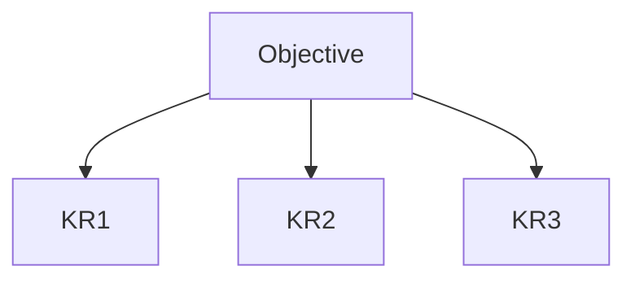

## Введение

OKR связывают амбицию с измеримым результатом.

## Раздел: Основы

Objective — качественная цель. KR — числовой результат (не список задач).

## Раздел: Практика

Антипаттерн: KR = «сделать кнопку». Нужно «конверсия +X п.п.» или «latency p95 < …».

## Раздел: На собесе

OKR не заменяют roadmap — дополняют фокус периода.

## Лаба

**Цель.** Написать 1O + 3KR.

**Шаги.**
1. Objective.
2. KR1 метрика.
3. KR2.
4. Вычеркнуть таскоподобный KR.
5. Связь со стратегией.

**В группу:** ревью KR на «тасковость».

**Готово, если…**
- [ ] O≠KR
- [ ] KR измеримы
- [ ] Нет тасков в KR

## Схема: OKR

## Тест

### KR vs task?

**Ответ:** результат vs активность

**Пояснение:** Кнопка — task; конверсия — KR.

### Сколько O за квартал?

**Ответ:** обычно мало (1–3)

**Пояснение:** Иначе нет фокуса.

### OKR = roadmap?

**Ответ:** нет

**Пояснение:** Разные артефакты.

## Шпаргалка

<h3>OKR</h3><pre><code>O: …
KR: metric = target</code></pre>

## Anki

### Front: Objective

Back:  qualitatively цель

### Front: KR

Back: числовой результат

### Front: антипаттерн

Back: таски в KR

## Итоги

- Метрики > активность
- Мало целей
- Связь со ставкой

## Ссылки

- Learn | [Strategy](/game/learn/pm-product-strategy)
- Далее: [Stakeholders](/game/learn/pm-stakeholders)
