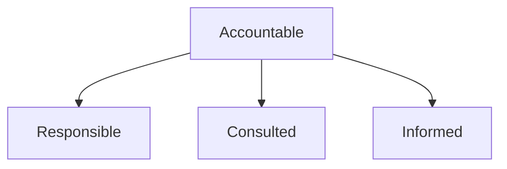

## Введение

Стейкхолдер — кто влияет или затронут решением.

## Раздел: Основы

Карта: влияние × интерес. RACI: Responsible, Accountable, Consulted, Informed.

## Раздел: Практика

Один Accountable на решение. PM часто Accountable за приоритет ценности.

## Раздел: На собесе

Конфликт интересов — норма; нужен явный trade-off.

## Лаба

**Цель.** RACI на запуск фичи.

**Шаги.**
1. Список стейкхолдеров.
2. RACI таблица.
3. Кто A?
4. Кого только I?
5. Эскалация спора.

**В группу:** спор sales vs support.

**Готово, если…**
- [ ] Карта есть
- [ ] Один A
- [ ] Эскалация ясна

## Схема: RACI

## Тест

### Accountable сколько?

**Ответ:** один

**Пояснение:** Иначе размытие.

### Consulted vs Informed?

**Ответ:** спрашиваем vs уведомляем

**Пояснение:** Не путать.

### Зачем карта?

**Ответ:** видеть влияние и риск саботажа

**Пояснение:** Коммуникационный план.

## Шпаргалка

<h3>RACI</h3><ul><li>R делает</li><li>A отвечает</li><li>C советует</li><li>I в курсе</li></ul>

## Anki

### Front: RACI

Back: матрица ролей

### Front: Accountable

Back: один владелец

### Front: influence

Back: влияние

## Итоги

- Один A
- Карта живая
- Дальше экономика

## Ссылки

- Learn | [PM01](/game/learn/pm-product-management)
- Далее: [P&L](/game/learn/pm-pnl-unit-econ)
