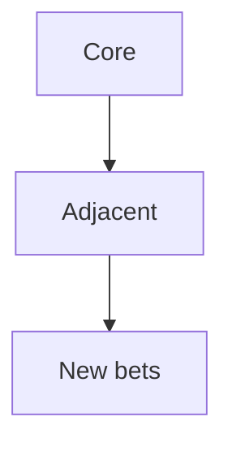

## Введение

CPO смотрит портфель, не одну фичу.

## Раздел: Основы

Горизонты: core / adjacent / disrupt. Ресурсы конечны — убивайте слабые ставки.

## Раздел: Практика

Связь с Product Portfolio Management из резюме CPO.

## Раздел: На собесе

Риск: все ставки «красные» одновременно.

## Лаба

**Цель.** Разложить 3 продукта по горизонтам.

**Шаги.**
1. Core.
2. Adjacent.
3. Что убить?
4. Метрика портфеля.
5. Коммуникация совету.

**В группу:** защитите убийство зомби-продукта.

**Готово, если…**
- [ ] Горизонты
- [ ] Kill criteria
- [ ] Фокус

## Схема: Портфель

## Тест

### Зачем kill criteria?

**Ответ:** не кормить зомби

**Пояснение:** Освободить ёмкость.

### CPO фокус?

**Ответ:** портфель ставок

**Пояснение:** Не микроменеджмент sprint.

### Связь с P&L?

**Ответ:** каждая ставка должна иметь экономический смысл

**Пояснение:** PM09.

## Шпаргалка

<h3>Portfolio</h3><ul><li>horizons</li><li>kill</li><li>capacity</li></ul>

## Anki

### Front: core

Back: основа

### Front: kill criteria

Back: условия закрытия

### Front: capacity

Back: ёмкость команд

## Итоги

- Портфель = выбор
- Убивайте зомби
- Дальше drill

## Ссылки

- Learn | [P&L](/game/learn/pm-pnl-unit-econ)
- Далее: [Drill](/game/learn/pm-interview-drill)
