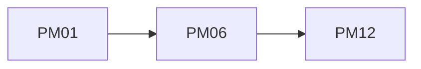

## Введение

Итог продуктового трека.

## Раздел: Основы

Junior: роли, RICE, CJM, Agile PO. Middle: strategy, roadmap, OKR, stakeholders. Senior: P&L, portfolio, drill.

## Раздел: Практика

Индекс slug — SERIES.md.

## Раздел: На собесе

Связки с SA/QA обязательны.

## Лаба

**Цель.** Заполнить ✅/❌.

**Шаги.**
1. Пройти SERIES.
2. 3 артефакта: CJM, RICE, OKR.
3. 1 ADR отказа.
4. Повторить ❌.
5. Готово.

**В группу:** взаимный review артефактов.

**Готово, если…**
- [ ] Чеклист
- [ ] Артефакты
- [ ] Кроссы

## Схема: Трек PM

## Тест

### С чего повтор?

**Ответ:** gap drill

**Пояснение:** Не всегда с PM01.

### Где Scrum канон?

**Ответ:** SA08/QA16

**Пояснение:** PM04 ссылка.

### Где USM?

**Ответ:** SA02

**Пояснение:** PM03 рядом.

## Шпаргалка

<h3>Чеклист</h3><ul><li>роли</li><li>приоритет</li><li>CJM/OKR</li><li>P&amp;L</li></ul>

## Anki

### Front: PM02

Back: RICE

### Front: PM07

Back: OKR

### Front: PM09

Back: P&L

## Итоги

- Трек закрыт
- Артефакты важнее теории
- Стык с SA/QA

## Ссылки

- Learn | [SERIES](/game/learn)
