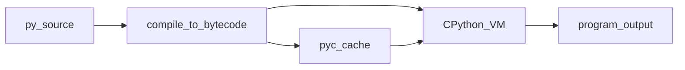

## Введение

На junior-собесе почти всегда спрашивают не «синтаксис print», а картину: что такое Python, как он запускает код и где его сильные/слабые стороны. Этот выпуск закрывает вводный блок вопросов (язык, интерпретатор, типизация, выбор стека) своими формулировками — без копипаста чужих ответов.

## Раздел: Язык и цикл исполнения

Python — высокоуровневый язык с динамической типизацией и автоматическим управлением памятью. Исходник компилируется в bytecode (часто в `__pycache__/*.pyc`), затем его выполняет виртуальная машина CPython. Поэтому корректнее говорить: «интерпретируемый с шагом компиляции в bytecode», а не «чисто интерпретируемый построчно».

Ключевые свойства, которые ждут на собесе:
- читаемость и быстрый цикл разработки;
- богатая стандартная библиотека и экосистема;
- «всё есть объект» — функции, классы, модули тоже объекты;
- императивный стиль по умолчанию, плюс средства FP (map, comprehensions) и полноценное ООП.

Исторически язык спроектировал Guido van Rossum (конец 1980-х, влияние ABC). Для практики важно отличие Python 3 от 2: Unicode по умолчанию, `print` как функция, иное целочисленное деление — Python 2 считать мёртвым для нового кода.

## Раздел: Когда брать Python и когда нет

**Уместен:** веб-API и бэкенд, автоматизация/скрипты, data/ML-пайплайны, прототипы, glue-код вокруг сервисов.

**Слабые места:** CPU-bound параллелизм упирается в GIL (подробнее в PY15); мобильные/жёсткий realtime; места, где нужен минимальный cold-start и жёсткий контроль памяти.

Фраза «Python лёгкий» на собесе — ловушка: синтаксис дружелюбный, но продакшен (типизация, async, упаковка, отладка утечек) требует глубины. Честный ответ: порог входа низкий, потолок — высокий.

Сравнение с Java кратко: меньше церемонии и статической проверки «из коробки», больше динамики и скорости итераций; взамен — другие компромиссы по перфу и tooling.

## Лаба

**Цель.** Сформулировать устный ответ на 60–90 секунд: «Что такое Python и когда вы его выберете?»

**Шаги.**
1. Запустите `python -c "import sys; print(sys.version)"` и запишите версию.
2. Создайте файл `hello.py` с функцией и вызовом под `if __name__ == "__main__":`.
3. Запустите файл; затем удалите guard и импортируйте модуль из REPL — сравните поведение.
4. Напишите 5 буллетов: 3 плюса и 2 минуса Python для вашего целевого стека (API / data / scripts).

**В группу:** зачитайте ответ на таймер 90 секунд; коллега задаёт один уточняющий вопрос («а GIL?», «а async?»).

**Готово, если…**
- [ ] Можете объяснить bytecode → CPython без шпаргалки
- [ ] Называете ≥2 сценария «не брать Python»
- [ ] Понимаете роль `__name__ == "__main__"`

## Схема: От .py до результата

## Тест

### Python компилируется или только интерпретируется?

**Ответ:** оба шага — bytecode, затем VM

**Пояснение:** исходник становится bytecode; исполняет его интерпретатор CPython (или другой рантайм).

### Что значит «динамическая типизация»?

**Ответ:** тип у значения, не у имени переменной

**Пояснение:** одна и та же переменная может ссылаться на объекты разных типов в разные моменты; проверка в основном в runtime.

### Когда Python — плохой выбор?

**Ответ:** жёсткий CPU-parallel / realtime / mobile

**Пояснение:** GIL, GC и модель исполнения хуже подходят к низколатентному realtime и нативной мобилке; для I/O-bound API часто ок.

## Шпаргалка

<h3>Суть</h3>
<ul>
<li>Высокоуровневый, динамический, GC, «всё объект»</li>
<li>Исходник → bytecode → CPython VM</li>
<li>Силён в скорости разработки и экосистеме; слаб в чистом CPU-parallel без обходов</li>
</ul>
<h3>Фразы на собесе</h3>
<pre><code>Python 3 only
bytecode + interpreter
low entry, high ceiling
use for API / scripts / data; rethink for hard realtime
</code></pre>

## Anki

### Front: Чем Python «исполняется» на практике?

Back: компиляция в bytecode и выполнение виртуальной машиной (обычно CPython)

### Front: «Всё в Python — объект» — что это значит?

Back: функции, классы, модули и значения — объекты с типом и атрибутами; переменная — имя-ссылка

### Front: Назовите два минуса Python на собесе

Back: GIL ограничивает CPU-threads; слабее для realtime/mobile; типы по умолчанию не статические (без mypy)

## Итоги

- Python = язык + рантайм (bytecode → VM), не «магия print»
- Динамическая типизация и объекты — база следующих выпусков
- Умейте честно сказать, где язык уместен, а где нет

## Ссылки

- [Документация Python — Tutorial](https://docs.python.org/3/tutorial/)
- [DEBAGanov — список вопросов (темы 1, 51–52, 102–105…)](https://github.com/DEBAGanov/interview_questions/blob/main/400%20вопросов%20с%20ответами%2C%20которые%20должен%20знать%20Python-разработчик.md)
- Learn | /game/learn
- Далее: [Типы и коллекции](/game/learn/py-types-collections)
