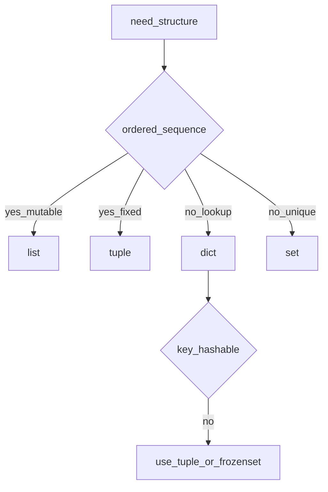

## Введение

После «что такое Python» собес уходит в коллекции: в чём разница list и tuple, что может быть ключом dict, когда брать set. Этот выпуск собирает junior-базу по типам и структурам данных — с акцентом на выбор структуры, а не заучивание всех методов.

## Раздел: Встроенные типы и последовательности

Числовые: `int`, `float`, `complex`. Логический `bool` — подкласс `int`. Текст — `str` (Unicode). Последовательности: `list` (изменяемая), `tuple` (неизменяемая), `str`, `range`.

Индексация с нуля; отрицательный индекс считает с конца (`a[-1]` — последний). Срез `a[start:stop:step]` возвращает новый объект того же «семейства» (для list — новый list), не включая `stop`.

`list` vs `tuple`:
- list — для набора, который меняете (append, sort);
- tuple — для фиксированной записи/ключа/распаковки; чуть дешевле по смыслу «контракта неизменности».

`append` добавляет один элемент; `extend` добавляет элементы из итерируемого. Путать на собесе — классика.

## Раздел: dict, set и выбор структуры

`dict` — отображение ключ → значение. Ключ должен быть **hashable** (неизменяемый по смыслу хеша): `str`, `int`, `tuple` из hashable, `frozenset`. `list` и обычный `set` ключами быть не могут.

`set` / `frozenset` — уникальные элементы, проверка принадлежности в среднем O(1). `frozenset` можно класть в другой set или использовать как ключ dict.

`collections.namedtuple` — tuple с именами полей: удобно для лёгких DTO без полного класса.

Когда что брать (кратко):
- упорядоченный изменяемый ряд → `list`;
- фиксированная запись / ключ составной → `tuple`;
- поиск по ключу → `dict`;
- уникальность / пересечения → `set`.

## Лаба

**Цель.** На практике почувствовать mutable vs immutable и hashable-ограничение.

**Шаги.**
1. Создайте `coords = (10, 20)` и dict `points = {coords: "A"}`.
2. Попробуйте ключ `[10, 20]` — поймайте `TypeError` и объясните почему.
3. Напишите функцию, которая из списка строк возвращает (а) уникальные в set, (б) частоты в dict.
4. Сравните `lst.append([1])` и `lst.extend([1])` на одном и том же стартовом списке.

**В группу:** нарисуйте таблицу «тип → mutable? → hashable? → типичный кейс» на 6 типов.

**Готово, если…**
- [ ] Объясняете list vs tuple без «tuple быстрее всегда»
- [ ] Называете правило ключей dict
- [ ] Не путаете append и extend

## Схема: Выбор коллекции

## Тест

### Чем list отличается от tuple?

**Ответ:** list изменяемый, tuple — нет

**Пояснение:** оба последовательности; tuple ещё годится как hashable-ключ, если элементы hashable.

### Что может быть ключом словаря?

**Ответ:** только hashable объекты

**Пояснение:** str/int/tuple из hashable/frozenset — да; list/dict/set — нет.

### Что делает extend у списка?

**Ответ:** добавляет элементы из итерируемого

**Пояснение:** `append(x)` кладёт `x` как один элемент; `extend(it)` разворачивает `it`.

## Шпаргалка

<h3>Суть</h3>
<ul>
<li>list — mutable sequence; tuple — immutable</li>
<li>dict/set — hash-таблицы; ключ/элемент set должен быть hashable</li>
<li>slice: start включительно, stop исключительно</li>
</ul>
<h3>Код</h3>
<pre><code>a[-1]; a[1:4]
d[(1, 2)] = "ok"   # tuple key
# d[[1, 2]] = "no" # TypeError
lst.append(x); lst.extend(iterable)
</code></pre>

## Anki

### Front: Почему list нельзя сделать ключом dict?

Back: list изменяемый и неhashable — хеш должен быть стабилен

### Front: append vs extend?

Back: append добавляет один объект; extend — все элементы из итерируемого

### Front: Когда выбрать set, а не list?

Back: нужна уникальность или быстрая проверка «есть ли элемент», порядок/дубликаты не важны

## Итоги

- Коллекции — про контракт (mutable/hashable), не про «все методы наизусть»
- Срезы и отрицательные индексы — must-have junior
- Выбор list/tuple/dict/set — частый практический вопрос

## Ссылки

- [Data model — стандартные типы](https://docs.python.org/3/library/stdtypes.html)
- [DEBAGanov — вопросы про типы/коллекции](https://github.com/DEBAGanov/interview_questions/blob/main/400%20вопросов%20с%20ответами%2C%20которые%20должен%20знать%20Python-разработчик.md)
- Learn | /game/learn
- Назад: [Intro Python](/game/learn/py-intro-python)
