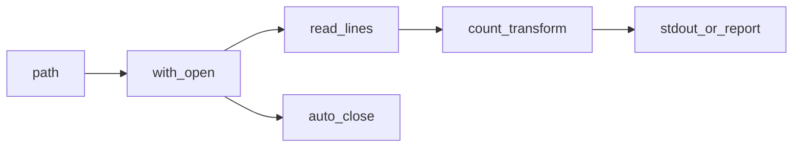

## Введение

Junior-собес часто смешивает операторы, строки и файлы в одну кучу мелких вопросов. Этот выпуск даёт карту: какие операторы есть, как устроен `str`, как безопасно читать/писать файлы и откуда берётся ввод.

## Раздел: Операторы и строки

Арифметика: `+ - * / // % **`. Сравнения возвращают `bool`. Логика: `and` / `or` / `not` (короткое замыкание). Membership: `in` / `not in`. Identity: `is` / `is not` (сравнивает объект, не значение — для `None` и синглтонов). Bitwise: `& | ^ ~ << >>`.

Строки неизменяемы (Unicode). Полезное: `split`/`join`, `strip`, `replace`, срезы, `f"..."` / `format`. `ord`/`chr` — код символа и обратно. `str` vs `repr`: человекочитаемо vs однозначное представление для отладки. Конкатенация в цикле через `+` плоха по стилю — лучше `join` или список кусков.

Регистр важен: Python case-sensitive. Проверки вроде `isalnum`, `isdigit` — частые мини-вопросы.

## Раздел: Файлы, os и ввод

`open(path, mode, encoding="utf-8")` + `with` (закрытие гарантировано). Режимы: `r`/`w`/`a`/`b`. Читать целиком / построчно; писать `write`/`writelines`. Обратный вывод файла — читать строки в список и развернуть (или итерировать аккуратно по размеру).

Модуль `os`: `getcwd`, `listdir`, `remove`/`unlink`, пути. Для новых проектов чаще `pathlib.Path`. CLI: `sys.argv` или `argparse`. Ввод: `input()`. Случайность: `random.random` / `randint` / `choice` / `shuffle` (in-place).

Числа в других системах: `int("ff", 16)`, `bin`/`hex`/`oct`.

## Лаба

**Цель.** Скрипт: прочитать текстовый файл, посчитать строки и слова, записать отчёт.

**Шаги.**
1. Создайте `notes.txt` на 5+ строк.
2. Скрипт с `argparse`: путь к файлу → печатает число строк/слов и пишет `report.txt`.
3. Добавьте режим «перевернуть строки» в новый файл.
4. Сравните `is` и `==` на маленьких int и на больших числах / строках.

**В группу:** объясните, почему `with open` предпочтительнее голого `open/close`.

**Готово, если…**
- [ ] Отличаете `is` от `==`
- [ ] Читаете файл в `with` с encoding
- [ ] Собираете строку через `join`, не через `+=` в горячем цикле

## Схема: Чтение файла

## Тест

### Чем // отличается от /?

**Ответ:** // — целочисленное деление с округлением вниз

**Пояснение:** `/` всегда float-деление в Python 3; `//` floor division.

### Зачем encoding в open?

**Ответ:** явно задать кодировку текста

**Пояснение:** иначе зависят платформа и сюрпризы с кириллицей.

### join vs конкатенация в цикле?

**Ответ:** join эффективнее и чище для многих кусков

**Пояснение:** строки неизменяемы; много `+` создаёт лишние объекты.

## Шпаргалка

<h3>Суть</h3>
<ul>
<li>Операторы: арифметика, логика, in, is, bitwise</li>
<li>str неизменяем; split/join/strip/f-strings</li>
<li>файлы через with + encoding; os/pathlib для путей</li>
</ul>
<h3>Код</h3>
<pre><code>with open(path, encoding="utf-8") as f:
    lines = f.readlines()
" ".join(parts)
sys.argv / argparse / input()
</code></pre>

## Anki

### Front: Когда использовать is, а не ==?

Back: сравнение идентичности объекта (часто с None), не равенства значений

### Front: Что делает strip у строки?

Back: убирает пробельные символы по краям (или заданные символы)

### Front: Как удалить файл в Python?

Back: os.remove / Path.unlink

## Итоги

- Операторы и строки — «мелочь», которой сыплют на junior
- Файлы почти всегда с `with` и явной кодировкой
- Дальше — функции и управление потоком (PY04)

## Ссылки

- [str methods](https://docs.python.org/3/library/stdtypes.html#string-methods)
- [Reading and Writing Files](https://docs.python.org/3/tutorial/inputoutput.html#reading-and-writing-files)
- [DEBAGanov — строки / операторы / файлы](https://github.com/DEBAGanov/interview_questions/blob/main/400%20вопросов%20с%20ответами%2C%20которые%20должен%20знать%20Python-разработчик.md)
- Learn | /game/learn
- Далее: [Функции](/game/learn/py-control-flow-functions)
