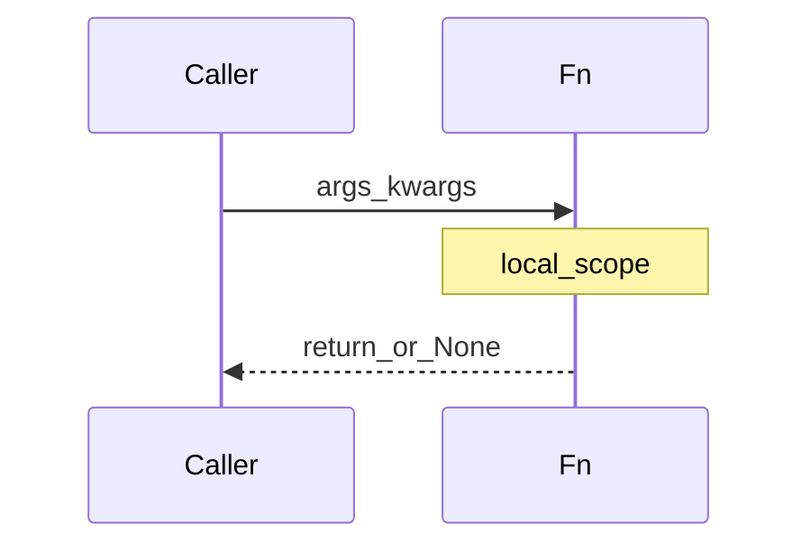

## Введение

Функции и циклы — ядро junior-собеса: `*args/**kwargs`, опасный дефолт `[]`, lambda, comprehensions, `enumerate`/`zip`. Здесь собираем рабочую модель без «магии».

## Раздел: Поток управления

`if` / `elif` / `else`. Циклы `for` (по итерируемому) и `while`. `break` выходит, `continue` к следующей итерации. У `for`/`while` есть `else`: выполняется, если цикл **не** прерван `break` — частая ловушка.

`pass` — пустой оператор «заглушка». Отдельного `switch` в старом стиле не было; в 3.10+ есть `match`/`case`. Тернарный: `a if cond else b`.

`range(start, stop, step)` — ленивая последовательность индексов. Бесконечный цикл прерывают `break` или сигнал/исключение.

## Раздел: Функции, lambda, comprehensions

`def` создаёт функцию; без `return` возвращается `None`. Можно вернуть несколько значений кортежем. `*args` собирает позиционные, `**kwargs` — именованные; проброс: `other(*args, **kwargs)`.

Опасность: `def f(x=[])` — дефолт создаётся **один раз**; мутации копятся. Пишите `None` и создавайте список внутри.

Lambda — одно выражение без имени, удобно для `key=` / коротких колбэков. `map`/`filter`/`reduce` (reduce из `functools`) — FP-стиль; часто читаемее comprehension. `enumerate`, `zip` — индексы и параллельный обход.

List/dict comprehensions: компактно и быстро для простых преобразований; избегайте, если логика с побочными эффектами или длиннее пары условий.

## Лаба

**Цель.** Утилиты без mutable-default и с красивыми comprehensions.

**Шаги.**
1. Функция `group_by_len(*words, **flags)` → dict длина→список слов; флаг `upper=True` нормализует регистр.
2. Намеренно сломайте версию с `def f(acc=[])` и покажите баг двумя вызовами.
3. Перепишите filter чётных через comprehension и через `filter`+lambda.
4. Разберите `for`/`else`: найдите простое число проверкой делителей с `else`.

**В группу:** объясните, когда lambda хуже `def`.

**Готово, если…**
- [ ] Не используете mutable default
- [ ] Объясняете *args/**kwargs
- [ ] Знаете for/else

## Схема: Вызов функции

## Тест

### Почему нельзя def f(items=[])?

**Ответ:** список-дефолт общий между вызовами

**Пояснение:** объект по умолчанию создаётся при определении функции один раз.

### Что возвращает функция без return?

**Ответ:** None

**Пояснение:** любое def неявно возвращает None, если не указан return.

### Когда срабатывает else у for?

**Ответ:** если цикл завершился без break

**Пояснение:** else — «не нашли / не прервали», не «иначе по условию if».

## Шпаргалка

<h3>Суть</h3>
<ul>
<li>for/while + break/continue; for-else без break</li>
<li>*args/**kwargs; без mutable defaults</li>
<li>lambda для коротких выражений; comprehensions для простых map/filter</li>
</ul>
<h3>Код</h3>
<pre><code>def f(*args, **kwargs): ...
def g(items=None):
    items = items or []
[x*x for x in xs if x &gt; 0]
</code></pre>

## Anki

### Front: Что такое *args?

Back: кортеж лишних позиционных аргументов

### Front: zip([1,2], ['a','b']) даст?

Back: итератор пар (1,'a'), (2,'b')

### Front: Чем list comprehension лучше длинного for?

Back: короче выражает «новый список из преобразования/фильтра» без лишних временных переменных

## Итоги

- Поток управления + функции — фундамент следующих тем
- Mutable default и for/else — любимые ловушки
- Дальше — модули и окружение (PY05)

## Ссылки

- [Defining Functions](https://docs.python.org/3/tutorial/controlflow.html#defining-functions)
- [DEBAGanov — функции / циклы / lambda](https://github.com/DEBAGanov/interview_questions/blob/main/400%20вопросов%20с%20ответами%2C%20которые%20должен%20знать%20Python-разработчик.md)
- Learn | /game/learn
- Далее: [Модули и venv](/game/learn/py-modules-packages-venv)
