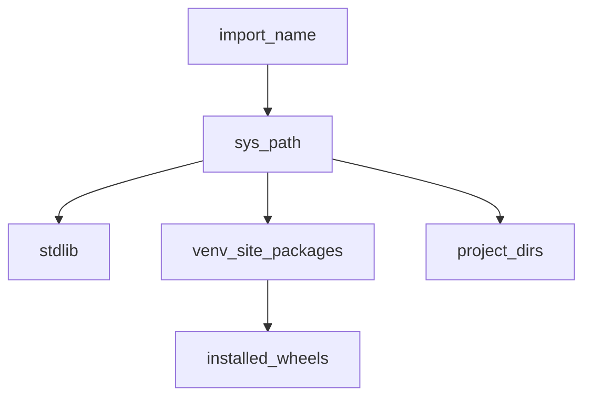

## Введение

«Как вы организуете код и зависимости?» — стандарт junior/middle. Нужно чётко разделять модуль и пакет, понимать `venv`, `pip`, wheels и зачем `__name__ == "__main__"`.

## Раздел: Модули и пакеты

Модуль — файл `.py` (или скомпилированное расширение). Пакет — каталог с модулями (исторически с `__init__.py`; namespace packages — без него). Импорт ищет по `sys.path`; `.pth` файлы могут дополнять пути. Stdlib лежит в установке Python (`sys.prefix` / `Lib`).

`__name__`: при прямом запуске равен `"__main__"`, при импорте — имя модуля. Паттерн:

```python
def main():
    ...

if __name__ == "__main__":
    main()
```

Перезагрузка: `importlib.reload` (осторожно в проде). `__pycache__` / `.pyc` — кеш bytecode. Импортировать «весь модуль» vs `from x import y` — вкус и риск загрязнения namespace; круговые импорты лечат рефакторингом.

## Раздел: venv, pip, wheels

Виртуальное окружение изолирует зависимости проекта (`python -m venv .venv`). Менеджеры: `pip`, иногда poetry/uv/pipenv — идея одна: зафиксировать версии. **Wheel** (`.whl`) — современный бинарный/готовый дистрибутив; **egg** — устаревший формат.

Транзитивные зависимости тянет resolver pip; конфликты версий — через constraints/`pip check`. Упаковка своего кода: `pyproject.toml` / setuptools, сборка wheel. Переменные окружения интерпретатора (`PYTHONPATH`, `PYTHONOPTIMIZE`) влияют на поиск модулей и `-O`.

## Лаба

**Цель.** Мини-пакет с venv и точкой входа.

**Шаги.**
1. `python -m venv .venv`, активируйте, `pip install requests` (или любой лёгкий пакет).
2. Структура `mylib/__init__.py`, `mylib/util.py`, скрипт `run.py` с guard `__main__`.
3. Запустите как скрипт и как `python -c "import mylib"`.
4. `pip freeze > requirements.txt`; объясните, чем freeze отличается от «прямых» зависимостей.

**В группу:** назовите 3 модуля stdlib, которыми пользуетесь ежедневно.

**Готово, если…**
- [ ] Отличаете module и package
- [ ] Поднимаете venv без путаницы с системным Python
- [ ] Объясняете wheel vs «поставить из исходников»

## Схема: Поиск импорта



## Тест

### Чем пакет отличается от модуля?

**Ответ:** пакет — набор модулей в каталоге; модуль — единица импорта (часто один файл)

**Пояснение:** пакет группирует API; модуль — конкретный `.py` или extension.

### Зачем virtualenv?

**Ответ:** изолировать зависимости проекта

**Пояснение:** разные проекты не ломают друг другу версии пакетов.

### Что такое wheel?

**Ответ:** формат дистрибутива пакета для быстрой установки

**Пояснение:** готовый архив под pip; eggs устарели.

## Шпаргалка

<h3>Суть</h3>
<ul>
<li>module = единица импорта; package = набор модулей</li>
<li>venv + pip + requirements/lock</li>
<li>__name__ == "__main__" для CLI-точки входа</li>
</ul>
<h3>Команды</h3>
<pre><code>python -m venv .venv
pip install -r requirements.txt
python -m pip install build
</code></pre>

## Anki

### Front: Где Python ищет модули?

Back: по элементам sys.path (stdlib, site-packages, cwd/PYTHONPATH)

### Front: Что в __pycache__?

Back: скомпилированный bytecode (.pyc) для ускорения последующих импортов

### Front: Зачем if __name__ == "__main__"?

Back: код запускается только при прямом старте файла, не при импорте

## Итоги

- Организация кода и окружения — база любого проекта
- venv обязателен в ответе junior
- Дальше — ООП (PY06)

## Ссылки

- [Modules](https://docs.python.org/3/tutorial/modules.html)
- [venv](https://docs.python.org/3/library/venv.html)
- [DEBAGanov — модули / venv / pip](https://github.com/DEBAGanov/interview_questions/blob/main/400%20вопросов%20с%20ответами%2C%20которые%20должен%20знать%20Python-разработчик.md)
- Learn | /game/learn
- Далее: [ООП база](/game/learn/py-oop-basics)
