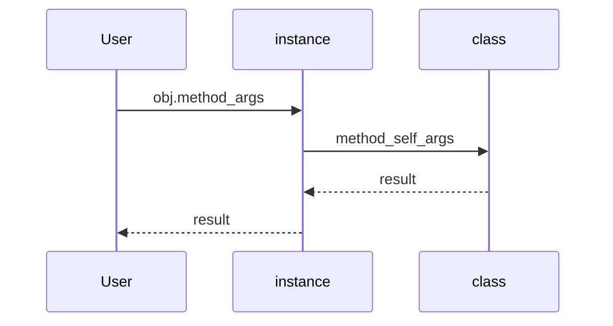

## Введение

Python — ООП-язык с множественным наследованием, но без Java-интерфейсов «как тип контракта». На junior ждут `self`, `__init__`, разницу class/instance attributes, `super`, `@property` / `@classmethod` / `@staticmethod`.

## Раздел: Класс, экземпляр, self

`class` создаёт тип; вызов класса — экземпляр. `self` — соглашенное имя первого аргумента метода: ссылка на экземпляр. `__init__` инициализирует уже созданный объект (не «конструктор» в узком C++ смысле; создание делает `__new__`).

Атрибуты класса общие для экземпляров; атрибуты экземпляра — в `obj.__dict__`. Ошибка в `__init__` прерывает инициализацию — объект может остаться в полусобранном состоянии, если вы его поймали снаружи неаккуратно.

Инкапсуляция мягкая: `_private` — соглашение, `__name` — name mangling. «Интерфейсы» — через протоколы/ABC (`abc.ABC`), duck typing, не через отдельный keyword.

## Раздел: Наследование и property

Наследование: `class Child(Parent)`. Вызов метода родителя — `super().method(...)`. `isinstance` / `issubclass` проверяют тип и иерархию. Множественное наследование есть (MRO — в PY12). Полиморфизм: один интерфейс метода — разное поведение в подклассах (переопределение).

`@property` — getter без скобок; `.setter` — мутатор. `@classmethod` получает `cls` (фабрики, альтернативные конструкторы). `@staticmethod` — функция в namespace класса без `self`/`cls`.

## Лаба

**Цель.** Модель `Shape` → `Rectangle` / `Circle` с area property.

**Шаги.**
1. Базовый класс с методом `area` → `NotImplementedError` или ABC.
2. Подклассы считают площадь; `isinstance` проверки в тестах.
3. `@classmethod from_str` для Rectangle из строки `"3x4"`.
4. Property `width` с валидацией > 0.

**В группу:** когда staticmethod лучше вынести в модульную функцию?

**Готово, если…**
- [ ] Объясняете self и __init__
- [ ] Используете super
- [ ] Пишете property с setter

## Схема: Вызов метода

## Тест

### Зачем self в методах?

**Ответ:** ссылка на конкретный экземпляр

**Пояснение:** без self метод не знает, чей state читать/менять.

### Чем classmethod отличается от staticmethod?

**Ответ:** classmethod получает cls; staticmethod — обычная функция в классе

**Пояснение:** classmethod удобен для фабрик; staticmethod не видит класс/экземпляр.

### Есть ли в Python интерфейсы как в Java?

**Ответ:** нет отдельного interface; есть ABC и duck typing

**Пояснение:** контракт задаётся поведением/абстрактными классами, не keyword interface.

## Шпаргалка

<h3>Суть</h3>
<ul>
<li>class → type; instance → объект с self</li>
<li>__init__ инициализирует; super для родителя</li>
<li>property / classmethod / staticmethod</li>
</ul>
<h3>Код</h3>
<pre><code>class A:
    def __init__(self, x): self.x = x
    @property
    def x_doubled(self): return self.x * 2
class B(A):
    def __init__(self, x, y):
        super().__init__(x)
        self.y = y
</code></pre>

## Anki

### Front: Где хранятся обычные атрибуты экземпляра?

Back: в obj.__dict__ (если нет slots)

### Front: Как вызвать метод родителя из наследника?

Back: super().method(...)

### Front: Что делает @property?

Back: позволяет читать метод как атрибут; можно добавить setter

## Итоги

- ООП-база закрывает большой кусок junior-вопросов
- Интерфейсы = ABC + утиная типизация
- Дальше — исключения (PY07)

## Ссылки

- [Classes](https://docs.python.org/3/tutorial/classes.html)
- [DEBAGanov — ООП](https://github.com/DEBAGanov/interview_questions/blob/main/400%20вопросов%20с%20ответами%2C%20которые%20должен%20знать%20Python-разработчик.md)
- Learn | /game/learn
- Далее: [Исключения](/game/learn/py-exceptions)
