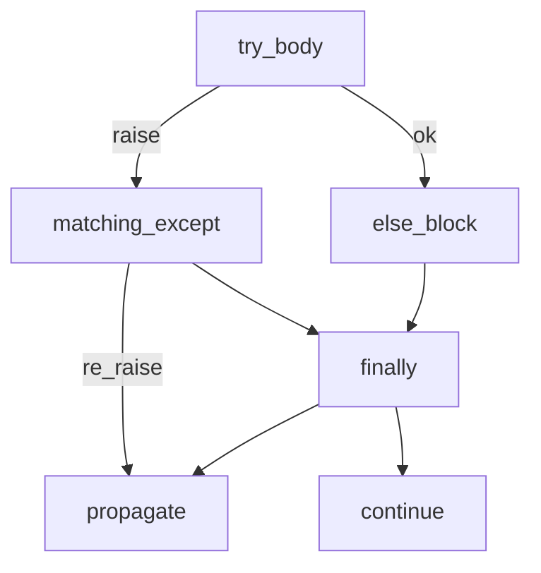

## Введение

Ошибки на собесе проверяют не только синтаксис `try`, но понимание `else`/`finally`, иерархии и того, что будет, если исключение не поймали. Собираем аккуратную модель обработки сбоев.

## Раздел: try / except / else / finally

```python
try:
    risky()
except ValueError as exc:
    handle(exc)
else:
    # только если исключения не было
    after_success()
finally:
    # всегда: освободить ресурс / залогировать завершение
    cleanup()
```

`raise` пробрасывает или создаёт исключение. `raise ... from exc` сохраняет цепочку причин. Ловите **конкретные** типы, не голый `except:` (он перехватит и `KeyboardInterrupt` в плохих вариантах со `BaseException`).

`NotImplementedError` — маркер «метод должен реализовать подкласс», не путать с `NotImplemented` (для операторов).

## Раздел: Иерархия и свои классы

База пользовательских ошибок — обычно `Exception` (не `BaseException`). Деление на ноль → `ZeroDivisionError` (под `ArithmeticError`). Runtime errors — ошибки во время исполнения vs SyntaxError на этапе разбора.

Свой тип:

```python
class DomainError(Exception):
    """Бизнес-ошибка домена."""
```

Если исключение не обработано, оно летит вверх по стеку и завершает поток/программу с traceback. `finally` выполняется даже при пробросе дальше — поэтому его любят для закрытия ресурсов (рядом с `with`).

## Лаба

**Цель.** Парсер числа с доменными ошибками и корректным finally.

**Шаги.**
1. `parse_positive(text)` → int > 0 или `ValueError` / свой `ParseError`.
2. Оберните вызов: except → сообщение, else → print ok, finally → print done.
3. Покажите разницу: поймали ошибку vs не поймали (traceback).
4. Добавьте `raise ParseError(...) from exc` при обёртке низкоуровневой ошибки.

**В группу:** когда лучше вернуть `None`/Result, а когда raise?

**Готово, если…**
- [ ] Объясняете else и finally
- [ ] Ловите конкретные типы
- [ ] Пишете свой Exception-класс

## Схема: Поток исключения



## Тест

### Когда выполняется else в try?

**Ответ:** если в try не было исключения

**Пояснение:** else не связан с except как «иначе ошибка»; это «успешный try».

### Зачем finally?

**Ответ:** код очистки, который выполнится всегда

**Пояснение:** и при успехе, и при ошибке, и при return из try.

### Что будет, если исключение не поймать?

**Ответ:** проброс вверх и обычно аварийное завершение с traceback

**Пояснение:** пока кто-то выше не обработает или интерпретатор не завершит поток.

## Шпаргалка

<h3>Суть</h3>
<ul>
<li>try/except/else/finally + raise</li>
<li>ловить конкретно; свои ошибки от Exception</li>
<li>finally ≈ гарантия cleanup (with ещё лучше для ресурсов)</li>
</ul>
<h3>Код</h3>
<pre><code>try:
    ...
except ValueError as e:
    raise DomainError("bad") from e
finally:
    cleanup()
</code></pre>

## Anki

### Front: BaseException vs Exception?

Back: BaseException включает SystemExit/KeyboardInterrupt; прикладной код обычно ловит Exception

### Front: NotImplementedError — когда?

Back: абстрактный/нереализованный метод в базовом классе

### Front: raise X from e — зачем?

Back: сохранить причинно-следственную цепочку исключений

## Итоги

- Корректная обработка ошибок — признак зрелого junior
- else/finally часто путают — закрепите схемой
- Дальше — stdlib re/json/copy (PY08)

## Ссылки

- [Errors and Exceptions](https://docs.python.org/3/tutorial/errors.html)
- [DEBAGanov — исключения](https://github.com/DEBAGanov/interview_questions/blob/main/400%20вопросов%20с%20ответами%2C%20которые%20должен%20знать%20Python-разработчик.md)
- Learn | /game/learn
- Далее: [re / json / copy](/game/learn/py-stdlib-re-json-copy)
