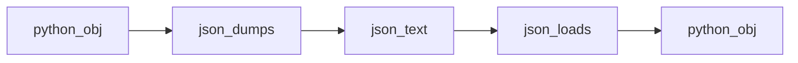

## Введение

Закрываем junior-блок практичным stdlib: регулярные выражения, JSON, копирование объектов. Это частые «инструментальные» вопросы рядом с файлами из PY03.

## Раздел: re и json

Модуль `re`: `search` (первое вхождение), `match` (с начала строки / с `re.fullmatch`), `findall`, `sub` / `subn`, `split`. Паттерны компилируйте через `re.compile` при многократном использовании. Email-пример на собесе — иллюстрация, не production-валидация RFC.

`json.loads` / `dumps` — текст JSON ↔ структуры Python (`dict`/`list`/…). `load`/`dump` — из/в файл. Для сложных объектов Python (set, datetime) нужен custom encoder или другой формат.

Сериализация шире: `pickle` — Python-специфичный бинарный формат (**небезопасен** на недоверенных данных). JSON — межъязыковой текст для API.

## Раздел: copy и утилиты

`copy.copy` — поверхностная копия: вложенные объекты разделяются. `copy.deepcopy` — рекурсивная независимая копия. Для списка `l[:]` / `list(l)` — shallow.

Рядом по собесу: `random.shuffle` (in-place), `os.remove` для удаления файла, чтение случайной строки из файла (прочитать все / reservoir sampling для больших).

## Лаба

**Цель.** Мини-пайплайн: JSON-файл → фильтр regex → deep copy для мутаций.

**Шаги.**
1. Файл `users.json` со списком объектов `{name, email}`.
2. Отфильтруйте email простым regex; невалидные сложите отдельно.
3. Сделайте shallow и deep copy одного пользователя с вложенным `meta={}`; измените `meta` и сравните оригинал.
4. `json.dump` результата с `ensure_ascii=False`, indent=2.

**В группу:** когда pickle уместен, а когда опасен?

**Готово, если…**
- [ ] Отличаете search/match/fullmatch
- [ ] Грузите/пишите JSON
- [ ] Объясняете shallow vs deep copy

## Схема: JSON round-trip

## Тест

### Чем search отличается от match?

**Ответ:** search ищет везде; match — с начала строки

**Пояснение:** для «целой строки» надёжнее fullmatch.

### Когда нужен deepcopy?

**Ответ:** когда есть вложенные изменяемые объекты и нужна полная изоляция

**Пояснение:** shallow копирует только верхний уровень ссылок.

### Почему pickle нельзя на пользовательском вводе?

**Ответ:** может выполнить произвольный код при загрузке

**Пояснение:** десериализация pickle небезопасна; для API берите JSON и схемы.

## Шпаргалка

<h3>Суть</h3>
<ul>
<li>re: search/match/sub/split/compile</li>
<li>json: loads/dumps, load/dump</li>
<li>copy vs deepcopy; pickle ≠ json</li>
</ul>
<h3>Код</h3>
<pre><code>re.search(r"...", text)
json.loads(s); json.dumps(obj, ensure_ascii=False)
copy.deepcopy(obj)
</code></pre>

## Anki

### Front: json.dumps что возвращает?

Back: строку JSON

### Front: shallow copy списка с вложенным dict — что общее?

Back: вложенный dict — тот же объект в оригинале и копии

### Front: subn в re — что лишнего против sub?

Back: возвращает кортеж (новая_строка, число_замен)

## Итоги

- Stdlib-инструменты закрывают «бытовые» вопросы junior
- JSON для API; pickle только для доверенных данных
- Дальше middle: итераторы и генераторы (PY09)

## Ссылки

- [re](https://docs.python.org/3/library/re.html)
- [json](https://docs.python.org/3/library/json.html)
- [copy](https://docs.python.org/3/library/copy.html)
- [DEBAGanov — re/json/copy](https://github.com/DEBAGanov/interview_questions/blob/main/400%20вопросов%20с%20ответами%2C%20которые%20должен%20знать%20Python-разработчик.md)
- Learn | /game/learn
- Далее: [Итераторы](/game/learn/py-iterators-generators)
