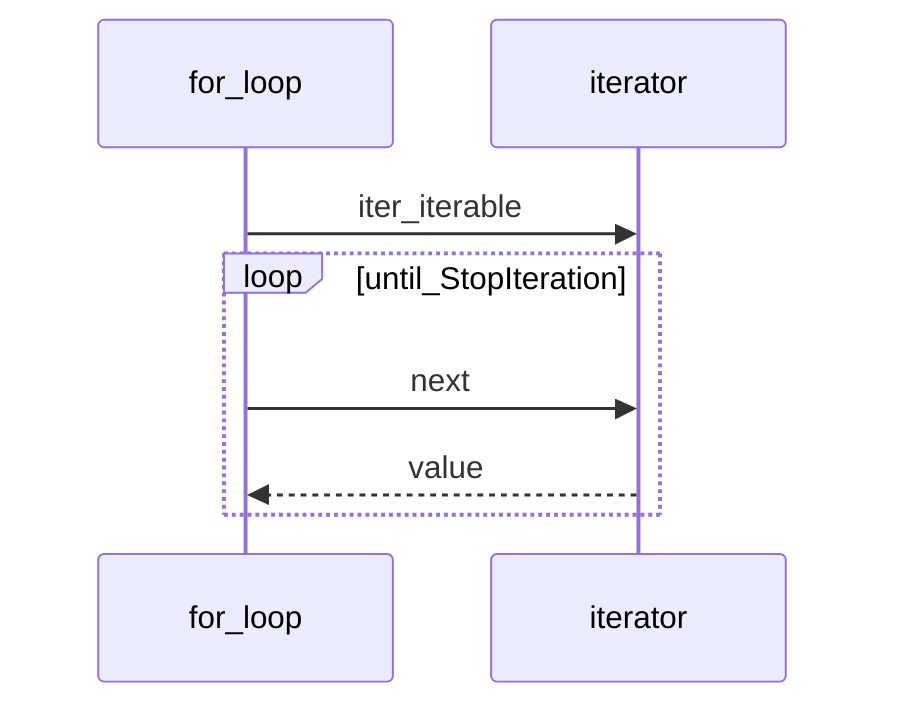

## Введение

Итераторы и генераторы — обязательный middle-блок: протокол `__iter__`/`__next__`, `yield`, отличие generator expression от list comprehension, почему генератор «одноразовый».

## Раздел: Протокол итератора

Итерируемое (`iterable`) даёт итератор через `iter(obj)` → вызывает `__iter__`. Итератор реализует `__next__` (и обычно `__iter__` возвращает self). `for` — сахар над этим протоколом до `StopIteration`.

Свой итератор — класс с состоянием. Генератор — функция с `yield`: при вызове возвращает generator object (итератор), при каждом `next` выполняется до следующего `yield`.

Генератор *является* итератором; обратное неверно: не каждый итератор — генератор. «Перевернуть генератор» напрямую нельзя — он однопроходный; соберите в list или пишите алгоритм иначе.

## Раздел: Comprehensions и выражения

List comprehension строит список сразу. Generator expression `(x for x in xs)` — лениво. Dict/set comprehensions — по аналогии. Используйте comprehension для простых преобразований; сложная логика с side effects лучше в явном цикле/генератор-функции.

`yield` приостанавливает функцию и отдаёт значение; можно `yield from` делегировать другому итерируемому. После исчерпания повторный обход пуст.

## Лаба

**Цель.** Свой range-подобный итератор и генератор батчей.

**Шаги.**
1. Класс `CountDown(n)` с `__iter__`/`__next__`.
2. Генератор `batches(iterable, size)` через yield списков.
3. Сравните память: list comprehension vs generator expression на большом range ( qualitatively).
4. Покажите исчерпание: два `for` по одному generator.

**В группу:** где в API-слое уместны генераторы (стриминг ответов, чтение файлов)?

**Готово, если…**
- [ ] Рисуете iterable vs iterator
- [ ] Пишете функцию с yield
- [ ] Не ожидаете повторного обхода генератора

## Схема: for под капотом

## Тест

### Чем генератор отличается от итератора?

**Ответ:** генератор — способ получить итератор через yield; итератор — любой объект с next

**Пояснение:** генератор всегда итератор; итератор может быть написан классом вручную.

### Что делает yield?

**Ответ:** отдаёт значение и замораживает состояние функции

**Пояснение:** при следующем next выполнение продолжается после yield.

### Почему второй for по генератору пустой?

**Ответ:** генератор исчерпан

**Пояснение:** однопроходный; нужен новый вызов функции-генератора.

## Шпаргалка

<h3>Суть</h3>
<ul>
<li>iterable → iter → iterator → next</li>
<li>yield создаёт generator-iterator</li>
<li>[] eager; () lazy generator expression</li>
</ul>
<h3>Код</h3>
<pre><code>def gen():
    yield 1
    yield 2
(x*x for x in range(10))
</code></pre>

## Anki

### Front: Кто бросает StopIteration?

Back: итератор при исчерпании (for перехватывает)

### Front: __iter__ у типичного итератора возвращает?

Back: self

### Front: yield from xs эквивалент?

Back: for x in xs: yield x (упрощённо)

## Итоги

- Протокол итерации — основа for, comprehensions, распаковки
- Генераторы экономят память на потоках данных
- Далее: декораторы и with (PY10)

## Ссылки

- [Iterators](https://docs.python.org/3/tutorial/classes.html#iterators)
- [Generators](https://docs.python.org/3/tutorial/classes.html#generators)
- [DEBAGanov — итераторы/генераторы](https://github.com/DEBAGanov/interview_questions/blob/main/400%20вопросов%20с%20ответами%2C%20которые%20должен%20знать%20Python-разработчик.md)
- Learn | /game/learn
- Далее: [Декораторы](/game/learn/py-decorators-context)
