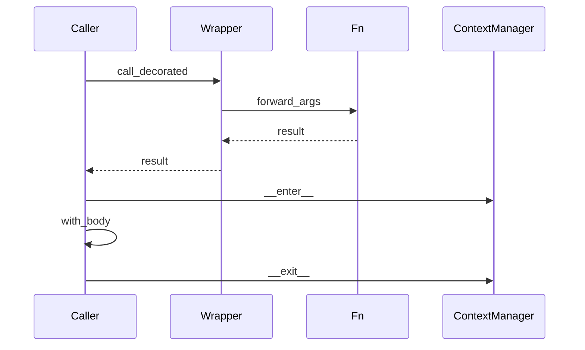

## Введение

На middle ждут умение не только вызвать `@something`, но и объяснить механизм: замыкание, обёртка, `functools.wraps`, зачем `with`. Этот выпуск — про декораторы и контекстные менеджеры как инструменты API-слоя (логирование, retry, транзакции, таймеры).

## Раздел: Замыкания и декораторы

Замыкание — функция, которая помнит переменные из enclosing scope после выхода из внешней функции. На этом держатся декораторы с параметрами и счётчики без глобалов (`nonlocal`).

Декоратор — функция (или callable), которая принимает функцию и возвращает другую (обычно обёртку) с доп. поведением:

```python
from functools import wraps

def trace(fn):
    @wraps(fn)
    def wrapper(*args, **kwargs):
        print("call", fn.__name__)
        return fn(*args, **kwargs)
    return wrapper

@trace
def add(a, b):
    return a + b
```

`@trace` над `add` эквивалентно `add = trace(add)`. `wraps` копирует `__name__`/`__doc__`, иначе отладка и OpenAPI ломаются.

Типичный учебный кейс: retry N раз при исключении — декоратор с аргументами (фабрика декораторов).

## Раздел: with и контекстные менеджеры

`with obj:` вызывает `obj.__enter__()` на входе и `obj.__exit__(exc_type, exc, tb)` на выходе — даже при исключении. Это безопасное освобождение ресурса (файл, lock, сессия БД).

Протокол можно собрать классом или через `contextlib.contextmanager` (генератор с `yield` посередине). `with` не заменяет все try/except: он про lifespan ресурса; обработку ошибок всё равно проектируете явно.

Связь с декораторами: оба — про «обернуть поведение»; декоратор — вокруг вызова функции, context manager — вокруг блока кода.

## Лаба

**Цель.** Написать декоратор retry и простой context manager таймера.

**Шаги.**
1. Реализуйте `@retry(times=3)`: при исключении повторяет вызов, иначе пробрасывает последнюю ошибку.
2. Добавьте `@wraps`.
3. Напишите `class Timer` с `__enter__`/`__exit__`, печатающий elapsed seconds.
4. Альтернатива: тот же Timer через `@contextmanager`.

**В группу:** разберите, что будет, если забыть `return wrapper` в декораторе.

**Готово, если…**
- [ ] Объясняете `@f` как `f = deco(f)`
- [ ] Знаете зачем `wraps`
- [ ] Можете нарисовать enter/exit на схеме

## Схема: with и декоратор



## Тест

### Что делает синтаксис @decorator над функцией?

**Ответ:** заменяет функцию результатом decorator(fn)

**Пояснение:** это сахар для `fn = decorator(fn)` сразу после определения.

### Зачем functools.wraps?

**Ответ:** сохранить метаданные исходной функции

**Пояснение:** без wraps wrapper маскирует `__name__` и docstring — ломает docs/отладку.

### Чем полезен with для файлов?

**Ответ:** гарантированно закрывает ресурс

**Пояснение:** `__exit__` вызывается и при успехе, и при исключении в блоке.

## Шпаргалка

<h3>Суть</h3>
<ul>
<li>Декоратор = callable вокруг функции</li>
<li>Замыкание держит состояние без global</li>
<li>with = __enter__ / __exit__ (или contextmanager)</li>
</ul>
<h3>Каркас</h3>
<pre><code>def deco(fn):
    @wraps(fn)
    def wrapper(*a, **k):
        return fn(*a, **k)
    return wrapper

with open(path) as f:
    data = f.read()
</code></pre>

## Anki

### Front: Эквивалент @deco над def f?

Back: f = deco(f)

### Front: Что такое замыкание?

Back: внутренняя функция + сохранённые переменные внешней области

### Front: Методы протокола контекстного менеджера?

Back: __enter__ и __exit__

## Итоги

- Декораторы и with — разные оси «обёртки», обе часты на middle
- wraps и корректный return wrapper — маркеры зрелости ответа
- Retry/timer — хорошие лайв-кодинг мини-задачи

## Ссылки

- [functools.wraps](https://docs.python.org/3/library/functools.html#functools.wraps)
- [contextlib](https://docs.python.org/3/library/contextlib.html)
- [DEBAGanov — декораторы / with](https://github.com/DEBAGanov/interview_questions/blob/main/400%20вопросов%20с%20ответами%2C%20которые%20должен%20знать%20Python-разработчик.md)
- Learn | /game/learn
- Далее по треку: [FP / collections](/game/learn/py-fp-collections-itertools)
