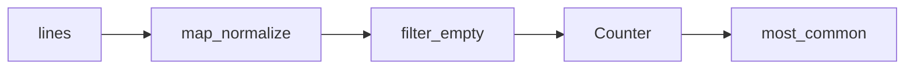

## Введение

Middle-собес любит `map`/`filter`/`reduce`, `collections.Counter` и пару приёмов `itertools`. Цель — показать, когда FP-стиль читаемее цикла и какие готовые структуры брать вместо самописных.

## Раздел: map, filter, reduce и HOF

Функции высшего порядка принимают/возвращают функции. `map(fn, xs)` применяет fn; `filter(pred, xs)` отбирает; `functools.reduce(fn, xs[, init])` сворачивает. В Python 3 map/filter ленивы (итераторы). Часто comprehension читаемее map+lambda.

`zip` склеивает потоки. Lambda уместна для короткого ключа; длинную логику выносите в `def`. FP хорошо стыкуется с неизменяемыми преобразованиями данных; для сложного state лучше явный цикл или ООП.

## Раздел: collections и itertools

Из `collections` на собесе чаще всего: `Counter`, `defaultdict`, `deque`, `namedtuple`/`deque`. `Counter` — частоты; удобные `most_common`.

`itertools`: `chain`, `islice`, `groupby`, `product`, `combinations`, `count`/`cycle`/`repeat` — строительные блоки ленивых пайплайнов без лишней памяти.

## Лаба

**Цель.** Пайплайн частот слов без лишних списков.

**Шаги.**
1. Прочитайте текст; нормализуйте слова генератором.
2. Посчитайте через `Counter`; top-5 `most_common`.
3. То же через `reduce` (учебно) и через один comprehension — сравните читаемость.
4. С помощью `itertools.islice` возьмите первые 10 уникальных слов из потока.

**В группу:** где map+lambda проиграет list comprehension в code review?

**Готово, если…**
- [ ] Пишете map/filter/reduce без шпаргалки
- [ ] Используете Counter
- [ ] Называете 3 инструмента itertools

## Схема: Ленивый пайплайн

## Тест

### map в Python 3 возвращает?

**Ответ:** итератор (лениво)

**Пояснение:** чтобы получить список — list(map(...)) или comprehension.

### Зачем Counter?

**Ответ:** подсчёт частоты элементов

**Пояснение:** словарь с удобными методами most_common и арифметикой счётчиков.

### reduce где лежит?

**Ответ:** functools.reduce

**Пояснение:** не builtin в Python 3.

## Шпаргалка

<h3>Суть</h3>
<ul>
<li>HOF: map/filter/reduce/zip</li>
<li>collections: Counter, defaultdict, deque</li>
<li>itertools для ленивых комбинаций</li>
</ul>
<h3>Код</h3>
<pre><code>from collections import Counter
from functools import reduce
Counter(words).most_common(5)
</code></pre>

## Anki

### Front: Чем filter отличается от map?

Back: filter отбирает элементы по предикату; map преобразует каждый

### Front: defaultdict(list) удобен когда?

Back: нужно append в словарь без проверки ключа

### Front: itertools.chain зачем?

Back: склеить несколько итерируемых в один поток

## Итоги

- FP-инструменты — про композицию преобразований данных
- collections/itertools экономят самописный код
- Далее: MRO и dunder (PY12)

## Ссылки

- [collections](https://docs.python.org/3/library/collections.html)
- [itertools](https://docs.python.org/3/library/itertools.html)
- [DEBAGanov — FP / collections](https://github.com/DEBAGanov/interview_questions/blob/main/400%20вопросов%20с%20ответами%2C%20которые%20должен%20знать%20Python-разработчик.md)
- Learn | /game/learn
- Далее: [MRO и dunder](/game/learn/py-oop-advanced-mro)
