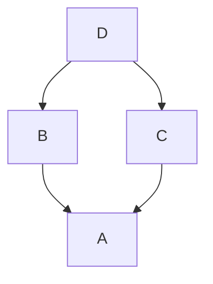

## Введение

После базового ООП middle спрашивают MRO, dunder-методы, `__slots__` и пространства имён. Нужна точная картина lookup и когда multiple inheritance оправдан.

## Раздел: MRO и namespaces

При множественном наследовании Python строит **MRO** (Method Resolution Order, C3 linearization): `Class.__mro__` / `Class.mro()`. `super()` идёт по MRO, не «только родитель в скобках».

Пространства имён: builtins → module global → enclosing (nonlocal) → local (LEGB при чтении имён). `globals()`/`locals()` показывают словари контекста. Атрибуты экземпляра обычно в `__dict__`.

Соглашения: `_single` — internal; `__double` без хвоста — name mangling в классе; `__dunder__` — протоколы языка.

## Раздел: Dunder и slots

Магические методы задают поведение: `__str__`/`__repr__`, `__eq__`, `__len__`, арифметика, контекст, итерация. Не вызывайте их руками без нужды — используйте `str(x)`, `len(x)`.

`__slots__` фиксирует набор атрибутов, убирает per-instance `__dict__` (экономия памяти, запрет случайных полей). Ограничения: наследование slots нужно проектировать аккуратно.

Old-style classes — история Python 2; в Python 3 все classes new-style (наследники object).

## Лаба

**Цель.** Ромб наследования и слоты.

**Шаги.**
1. Классы A, B(A), C(A), D(B,C) с методом `ping`; напечатайте `D.__mro__` и кто отвечает на `ping` через super-цепочку.
2. Класс с `__slots__ = ("x", "y")`; попробуйте присвоить `z` — поймайте AttributeError.
3. Реализуйте `__repr__` и `__eq__` для точки.
4. Покажите LEGB на вложенной функции с `nonlocal`.

**В группу:** когда multiple inheritance — запах, а когда mixin уместен?

**Готово, если…**
- [ ] Читаете __mro__
- [ ] Объясняете super при diamond
- [ ] Знаете зачем slots

## Схема: MRO diamond

## Тест

### Что такое MRO?

**Ответ:** порядок поиска методов при наследовании

**Пояснение:** C3-линеаризация; смотрите Class.__mro__.

### Зачем __slots__?

**Ответ:** ограничить атрибуты и сэкономить память

**Пояснение:** без __dict__ у каждого экземпляра.

### LEGB — расшифровка?

**Ответ:** Local, Enclosing, Global, Builtins

**Пояснение:** порядок поиска имён при чтении переменной.

## Шпаргалка

<h3>Суть</h3>
<ul>
<li>MRO / super() при множественном наследовании</li>
<li>dunder = протоколы языка</li>
<li>slots против произвольного __dict__</li>
</ul>
<h3>Код</h3>
<pre><code>D.__mro__
class P:
    __slots__ = ("x",)
</code></pre>

## Anki

### Front: super() ищет метод где?

Back: в следующем классе по MRO текущего типа

### Front: __repr__ vs __str__?

Back: repr для отладки/однозначности; str для пользователя

### Front: Что в obj.__dict__?

Back: атрибуты экземпляра (если нет slots)

## Итоги

- MRO и dunder — язык «под капотом» ООП
- slots — точечная оптимизация, не default
- Далее: стиль и typing (PY13)

## Ссылки

- [Data model](https://docs.python.org/3/reference/datamodel.html)
- [DEBAGanov — MRO / dunder / slots](https://github.com/DEBAGanov/interview_questions/blob/main/400%20вопросов%20с%20ответами%2C%20которые%20должен%20знать%20Python-разработчик.md)
- Learn | /game/learn
- Далее: [PEP8 и typing](/game/learn/py-typing-pep8-static)
