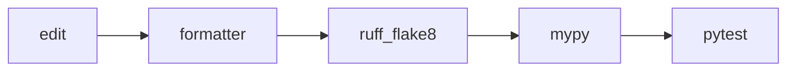

## Введение

Middle ожидают не только «работающий скрипт», но стиль (PEP 8), docstring и type hints. Статический анализ (ruff/flake8/mypy) — норма команды; на собесе важно объяснить зачем.

## Раздел: PEP 8 и docstring

PEP 8 — соглашения: отступы 4 пробела, длина строк, `snake_case` функций/переменных, `CapWords` классов, импорты группами, пробелы вокруг операторов. Это не компилятор, а читаемость; линтер автоматизирует споры.

Docstring — строка документации сразу под `def`/`class`/`module`; доступна как `__doc__`, через `help()`. Хороший docstring: что делает, аргументы, возврат, исключения. `dir(obj)` — список атрибутов; не замена документации.

Проверка синтаксиса без запуска: `python -m py_compile file.py`.

## Раздел: Typing и линтеры

Аннотации: `def f(x: int) -> str: ...`. Модуль `typing` / встроенные generics (3.9+): `list[int]`, `dict[str, Any]`. Проверка не в runtime CPython по умолчанию — её делают **mypy**/pyright. Для middle это must-have в ответе, даже если в «400 вопросах» typing мало.

Линтеры/форматтеры: ruff, flake8, pylint, black/ruff format. Статический анализ ловит неиспользуемое, тени имён, грубые баги до прода.

## Лаба

**Цель.** Модуль с аннотациями, docstring и чистым ruff/mypy.

**Шаги.**
1. Функции с type hints и Google/Numpy-style docstring.
2. Намеренная ошибка типа; покажите, что CPython молчит, mypy — нет.
3. Прогоните ruff check (или flake8) и исправьте замечания.
4. `python -m py_compile` на файле с синтаксической ошибкой.

**В группу:** какие правила PEP 8 вы готовы нарушить осознанно?

**Готово, если…**
- [ ] Пишете осмысленный docstring
- [ ] Добавляете аннотации к публичным функциям
- [ ] Называете роль mypy vs runtime

## Схема: Качество кода

## Тест

### Что такое PEP 8?

**Ответ:** руководство по стилю кода Python

**Пояснение:** соглашения об именах, отступах, импортах для читаемости.

### Где берётся help(f)?

**Ответ:** в основном из docstring объекта

**Пояснение:** help форматирует __doc__ и сигнатуру.

### Зачем mypy, если есть типы в сигнатуре?

**Ответ:** CPython не проверяет аннотации сам

**Пояснение:** mypy делает статический анализ до запуска.

## Шпаргалка

<h3>Суть</h3>
<ul>
<li>PEP 8 = стиль; docstring = документация</li>
<li>type hints + mypy</li>
<li>ruff/flake8 до ревью человека</li>
</ul>
<h3>Код</h3>
<pre><code>def add(a: int, b: int) -&gt; int:
    """Вернуть сумму a и b."""
    return a + b
</code></pre>

## Anki

### Front: Как проверить синтаксис без выполнения кода?

Back: python -m py_compile file.py

### Front: snake_case vs CapWords?

Back: функции/переменные vs классы (PEP 8)

### Front: Аннотации влияют на скорость runtime?

Back: обычно нет существенного эффекта; это подсказки для инструментов и людей

## Итоги

- Стиль и типы — часть middle-планки
- Линтер и mypy закрывают класс ошибок раньше прода
- Далее: asyncio (PY14)

## Ссылки

- [PEP 8](https://peps.python.org/pep-0008/)
- [typing](https://docs.python.org/3/library/typing.html)
- [DEBAGanov — PEP8 / docstring / анализ](https://github.com/DEBAGanov/interview_questions/blob/main/400%20вопросов%20с%20ответами%2C%20которые%20должен%20знать%20Python-разработчик.md)
- Learn | /game/learn
- Далее: [Asyncio](/game/learn/py-async-io)
