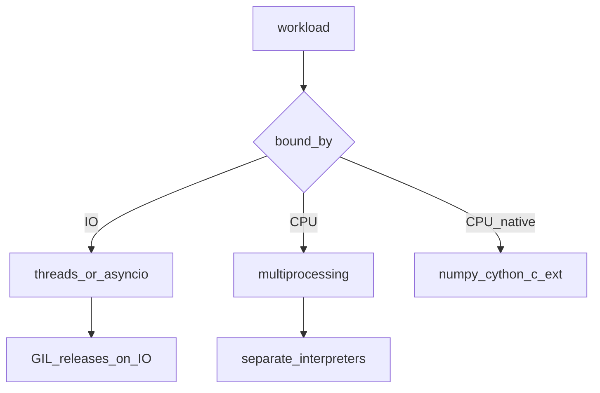

## Введение

Вопросы про GIL, потоки и память отделяют middle от «синтаксического» junior. Нужна связная модель: зачем GIL, когда threads помогают, как устроены refcount и GC, с чего начать при утечке. Этот выпуск собирает блок concurrency/memory без воды.

## Раздел: Threads, processes и GIL

**Threading** делит память процесса: удобно для I/O-bound (сеть, диск), пока поток ждёт. **Multiprocessing** — отдельные процессы и память: обход GIL для CPU-bound ценой IPC и старта процессов.

**GIL** (Global Interpreter Lock) в CPython позволяет в каждый момент исполнять bytecode Python только одному потоку в процессе. Поэтому чистый Python CPU-код на threads почти не ускоряется. GIL всё ещё упрощает безопасность refcount и совместимость C-расширений; для параллелизма CPU берут processes, нативный код (NumPy/Cython), или другой рантайм.

Жизненный цикл потока: create → start → running → join/terminate. Планирует ОС; в Python API — `threading.Thread`, пулы `concurrent.futures`.

Аргументы в функции передаются **по ссылке на объект** (call by object sharing): имя параметра — локальная ссылка на тот же объект; переприсвоение параметра снаружи не видно, мутация mutable — видна.

## Раздел: Память, GC и отладка утечек

CPython считает ссылки (`sys.getrefcount` / `id` объекта). Когда счётчик достигает нуля — объект освобождается. Циклические ссылки ловит generational GC (`gc` module). Не вся память обязательно возвращается ОС сразу при выходе — аллокатор и фрагментация.

`dict`/`set` внутри — хеш-таблицы: средний lookup O(1), память с запасом под load factor. Интернирование маленьких строк/ints — деталь оптимизации, не контракт для бизнес-логики.

Утечка в проде — чеклист:
1. воспроизвести рост RSS под нагрузкой;
2. `tracemalloc` / `objgraph` / `gc.garbage` (осторожно);
3. искать кэши без лимита, циклы с `__del__`, неосвобождённые ресурсы;
4. отделить «утечку Python-объектов» от роста нативной памяти расширений.

## Лаба

**Цель.** Наблюдаемо сравнить threads vs processes на CPU-задаче и потрогать gc.

**Шаги.**
1. Напишите CPU-bound функцию (например, суммирование больших range в цикле).
2. Замерьте время: 4× ThreadPoolExecutor vs 4× ProcessPoolExecutor.
3. Создайте два объекта с циклическими ссылками; вызовите `gc.collect()` и проверьте, что цикл собирается.
4. Включите `tracemalloc.start()`, сделайте N аллокаций, снимите top статистику.

**В группу:** объясните вслух, почему для HTTP-клиента threads часто ок, а для тяжёлого JSON-парсинга CPU — нет.

**Готово, если…**
- [ ] Формулируете GIL без мифа «Python не многопоточный»
- [ ] Отличаете I/O-bound и CPU-bound выбор
- [ ] Знаете роль refcount и зачем gc

## Схема: Выбор параллелизма

## Тест

### Почему threads плохо ускоряют чистый CPU-код в CPython?

**Ответ:** из-за GIL один bytecode-поток за раз

**Пояснение:** потоки полезны при ожидании I/O; для CPU — процессы или нативные расширения.

### Как передаются аргументы в функцию?

**Ответ:** по ссылке на объект (object sharing)

**Пояснение:** параметр — новое имя на тот же объект; мутации mutable видны вызывающему.

### Зачем нужен модуль gc, если есть refcount?

**Ответ:** собирать циклические ссылки

**Пояснение:** refcount не разрывает циклы A↔B; генерационный GC — да.

## Шпаргалка

<h3>Суть</h3>
<ul>
<li>I/O → threads/asyncio; CPU → processes / native</li>
<li>GIL = один Python-bytecode поток в процессе CPython</li>
<li>refcount + cyclic GC; утечки искать с tracemalloc</li>
</ul>
<h3>Ориентиры</h3>
<pre><code>threading / concurrent.futures.ThreadPoolExecutor
multiprocessing / ProcessPoolExecutor
import gc, tracemalloc
</code></pre>

## Anki

### Front: Когда брать multiprocessing вместо threading?

Back: CPU-bound задачи в CPython, где GIL мешает ускорению

### Front: Что такое GIL одной фразой?

Back: блокировка, из-за которой bytecode Python в процессе исполняет один поток

### Front: Кто собирает циклические ссылки?

Back: generational garbage collector (модуль gc)

## Итоги

- GIL не отменяет многопоточность — меняет профиль ускорения
- Память = refcount + GC; «утечка» требует метода, не гадания
- Этот блок — мост к senior-темам perf и prod-диагностики

## Ссылки

- [threading — docs](https://docs.python.org/3/library/threading.html)
- [gc — docs](https://docs.python.org/3/library/gc.html)
- [DEBAGanov — GIL / память / threads](https://github.com/DEBAGanov/interview_questions/blob/main/400%20вопросов%20с%20ответами%2C%20которые%20должен%20знать%20Python-разработчик.md)
- Learn | /game/learn
- Ранее по смыслу: [Asyncio](/game/learn/py-async-io)
