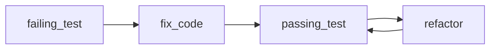

## Введение

Тесты и отладка на middle — про процесс: arrange-act-assert, фикстуры, когда брать pdb. В источнике сильнее unittest/pdb; в реальных командах чаще pytest — оба должны быть в ответе.

## Раздел: unittest и подход к тестам

`unittest.TestCase`: методы `test_*`, `assertEqual`/`assertRaises`, `setUp`/`tearDown`. Запуск: `python -m unittest`. Хороший unit-тест: быстрый, изолированный, детерминированный, проверяет одно поведение.

Пирамида: много unit, меньше integration, мало e2e. Моки (`unittest.mock`) — для границ (сеть, время), не для всего подряд.

## Раздел: pytest и pdb

pytest: меньше бойлерплейта, `assert` с интроспекцией, **fixtures**, `@pytest.mark.parametrize`. Фикстуры собирают данные/ресурсы; parametrize гоняет один тест на наборе входов — must-have для middle.

Отладка: `pdb` / `breakpoint()` (3.7+). Команды: `n` next, `s` step, `c` continue, `l` list, `p` print, `b` breakpoint. Альтернативы: IDE debugger, логирование вместо print-спама.

Цикл: падение → минимальный воспроизводящий тест → фикс → зелёный прогон.

## Лаба

**Цель.** Покрыть функцию pytest + поймать баг в pdb.

**Шаги.**
1. Функция `clamp(x, lo, hi)` с намеренным багом на границе.
2. unittest-тест и pytest-тест с parametrize.
3. Фикстура с временным путём файла (`tmp_path`).
4. Поставьте `breakpoint()` и пройдите баг шагами `n`/`p`.

**В группу:** что вы не мокаете принципиально?

**Готово, если…**
- [ ] Пишете pytest с parametrize
- [ ] Знаете 4 команды pdb
- [ ] Чините через failing test first

## Схема: Красный-зелёный

## Тест

### Чем pytest удобнее unittest на практике?

**Ответ:** меньше бойлерплейта, фикстуры, parametrize

**Пояснение:** assert обычный; плагины и фикстуры масштабируются лучше.

### Зачем parametrize?

**Ответ:** один тест — много наборов вход/ожидание

**Пояснение:** меньше копипаста, лучше таблица кейсов.

### Как поставить точку останова в коде 3.7+?

**Ответ:** breakpoint()

**Пояснение:** входит в pdb (или другой debugger по PYTHONBREAKPOINT).

## Шпаргалка

<h3>Суть</h3>
<ul>
<li>unit = быстро и изолированно</li>
<li>pytest fixtures + parametrize</li>
<li>pdb: n/s/c/p/l/b</li>
</ul>
<h3>Код</h3>
<pre><code>@pytest.mark.parametrize("x,y", [(1,1),(2,2)])
def test_id(x, y):
    assert x == y
breakpoint()
</code></pre>

## Anki

### Front: setUp в unittest — когда вызывается?

Back: перед каждым test-методом

### Front: Что такое fixture в pytest?

Back: переиспользуемая подготовка данных/ресурсов для тестов

### Front: Команда pdb step into?

Back: s

## Итоги

- Тесты — часть дизайна, не послесловие
- pytest — де-факто стандарт; unittest знать для собеса/легаси
- Далее senior: дескрипторы (PY17)

## Ссылки

- [unittest](https://docs.python.org/3/library/unittest.html)
- [pytest](https://docs.pytest.org/)
- [pdb](https://docs.python.org/3/library/pdb.html)
- [DEBAGanov — тесты / pdb](https://github.com/DEBAGanov/interview_questions/blob/main/400%20вопросов%20с%20ответами%2C%20которые%20должен%20знать%20Python-разработчик.md)
- Learn | /game/learn
- Далее: [Дескрипторы](/game/learn/py-descriptors-metaclasses)
