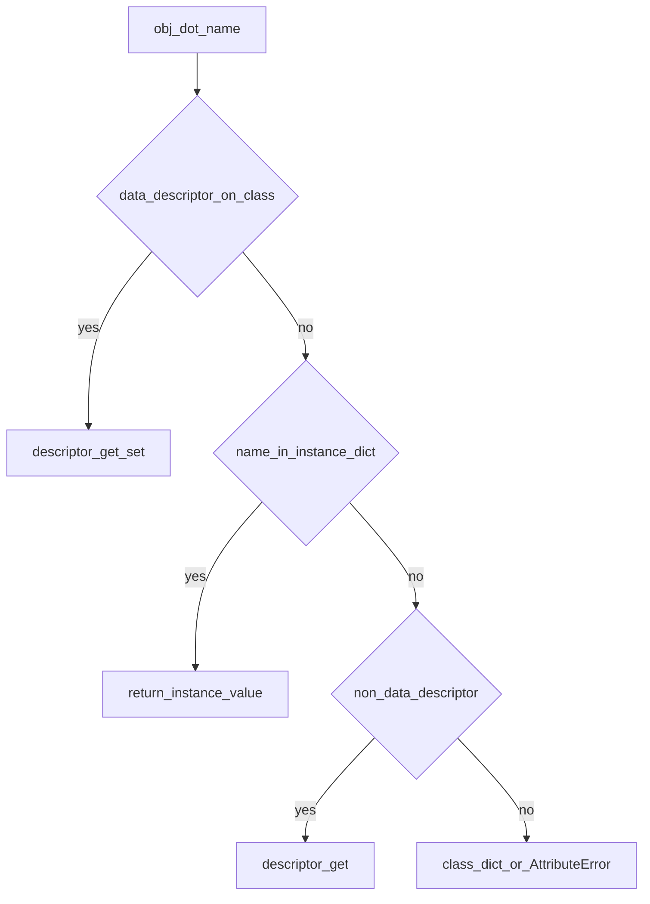

## Введение

Senior-вопросы про дескрипторы и метаклассы проверяют, понимаете ли вы модель атрибутов и создание классов — и умеете ли **не** тащить метакласс в каждый сервис. Разберём механизмы, связь с `@property` и здравые границы применения.

## Раздел: Дескрипторы

Дескриптор — объект с `__get__` / `__set__` / `__delete__`, лежащий в атрибуте **класса**. При доступе `obj.x` интерпретатор может делегировать в дескриптор вместо обычного lookup в `__dict__` экземпляра.

- **Data descriptor** (`__set__` или `__delete__`) сильнее instance dict.
- **Non-data** (только `__get__`, как функции/методы) слабее: значение в `obj.__dict__` перекрывает.

`@property`, `@classmethod`, `@staticmethod` — дескрипторы из коробки. Декоратор функции ≠ дескриптор: декоратор оборачивает callable; дескриптор управляет протоколом доступа к атрибуту. Часто property реализуют через дескриптор, а «синтаксический сахар» декоратора лишь удобная форма.

Зачем писать свои: валидация полей, lazy attributes, ORM-колонки, typed slots-подобные поля.

## Раздел: Метаклассы и type()

Класс — тоже объект; его тип обычно `type`. Метакласс — «класс класса»: контролирует создание класса (`__new__` / `__init__` метакласса). Большинство задач закрываются декораторами класса, `__init_subclass__` и дескрипторами — метакласс оставляйте для фреймворков (регистрация моделей, API DSL).

Создать класс без слова `class`:

```python
MyClass = type("MyClass", (Base,), {"x": 1, "hello": lambda self: "hi"})
```

Это тот же путь, что использует синтаксис `class`. Кастомный метакласс:

```python
class Meta(type):
    def __new__(mcls, name, bases, namespace, **kw):
        namespace.setdefault("registry_name", name.lower())
        return super().__new__(mcls, name, bases, namespace)

class Model(metaclass=Meta):
    pass
```

На собесе ценится фраза: «метакласс меняет, *как* создаётся класс; дескриптор — *как* читается/пишется атрибут».

## Лаба

**Цель.** Свой data descriptor и крошечный метакласс-регистр.

**Шаги.**
1. Напишите `PositiveInt` дескриптор: в `__set__` отвергайте значения ≤ 0.
2. Встройте его в класс `Account` с полем `balance`.
3. Метакласс `PluginMeta` добавляет каждый новый класс в `PluginMeta.registry`.
4. Сравните тот же registry через `__init_subclass__` — короче ли код?

**В группу:** решите, где в вашем стеке (Django ORM / pydantic / FastAPI) уже спрятаны дескрипторы/метаклассы.

**Готово, если…**
- [ ] Отличаете data vs non-data descriptor
- [ ] Можете создать класс через `type(...)`
- [ ] Называете альтернативы метаклассу

## Схема: Lookup атрибута



## Тест

### Чем data descriptor отличается от non-data?

**Ответ:** наличием __set__/__delete__; приоритет над instance dict

**Пояснение:** property с setter — data; обычные функции на классе — non-data.

### Что такое метакласс?

**Ответ:** класс, экземпляры которого — классы

**Пояснение:** обычно `type`; кастомный metaclass вмешивается в создание class object.

### Как создать класс без ключевого слова class?

**Ответ:** type(name, bases, namespace_dict)

**Пояснение:** синтаксис class — сахар над вызовом метакласса (по умолчанию type).

## Шпаргалка

<h3>Суть</h3>
<ul>
<li>Дескриптор = протокол атрибута (__get__/__set__)</li>
<li>property/classmethod — встроенные дескрипторы</li>
<li>Метакласс = контроль создания класса; чаще overkill</li>
</ul>
<h3>Ориентиры</h3>
<pre><code>type("Name", (object,), {"a": 1})
class A(metaclass=Meta): ...
# prefer: __init_subclass__, class decorator, descriptors
</code></pre>

## Anki

### Front: Почему функции на классе ведут себя как методы?

Back: объекты функций — non-data descriptors с __get__, который делает bound method

### Front: type(name, bases, dict) — что возвращает?

Back: новый объект класса

### Front: Когда метакласс оправдан?

Back: фреймворки с регистрацией/DSL; в прикладном коде чаще __init_subclass__ или декоратор класса

## Итоги

- Дескрипторы объясняют property и магию ORM-полей
- Метаклассы — редкий инструмент; знание важнее привычки применять
- Senior-ответ = механизм + граница применимости

## Ссылки

- [Descriptor HowTo Guide](https://docs.python.org/3/howto/descriptor.html)
- [Metaclasses — data model](https://docs.python.org/3/reference/datamodel.html#metaclasses)
- [DEBAGanov — дескрипторы / метаклассы](https://github.com/DEBAGanov/interview_questions/blob/main/400%20вопросов%20с%20ответами%2C%20которые%20должен%20знать%20Python-разработчик.md)
- Learn | /game/learn
- Ранее: [Тесты и pdb](/game/learn/py-testing-debug)
